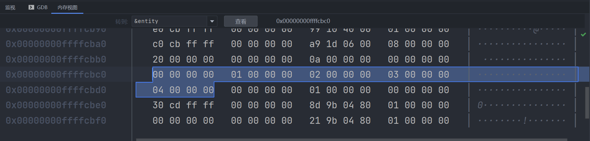
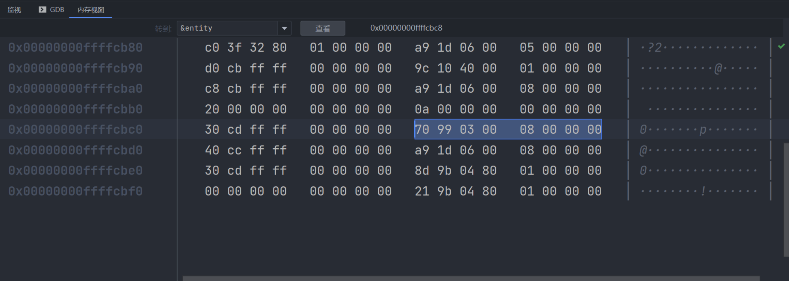
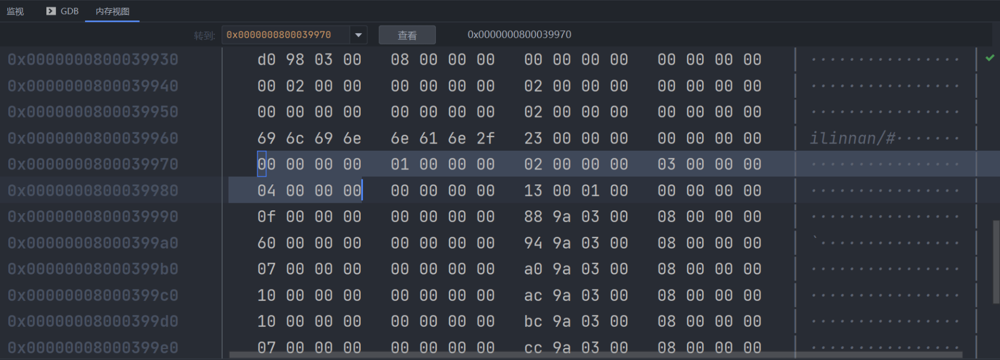

指针是数组的主要工作基础

声明方式

在Java中我们需要创建数组是这样的`type[] name = new type[size]`

```java
public class Main {
    public static void main(String[] args) {
        int[] arr = new int[5];
    }
}
```

在C++中，在栈上创建数组是这样的`type name[size]`

```C++
int main() {
    int arr[5];
    return 0;
}
```

访问方式和Java中相同

```C++
#include <iostream>

int main() {
    int arr[5];
    for (int i = 0; i < 5; i++) {
        arr[i] = i;
    }
    for (int i = 0; i < 5; i++) {
        std::cout << arr[i] << std::endl;
    }
    return 0;
}
```

foreach也可

```C++
for (int i : arr) {
    std::cout << i << std::endl;
}
```

因为其实数组的工作方式是指针，所以可以写出以下花哨的代码

```C++
#include <iostream>

int main() {
    int arr[5];
    arr[2] = 6;
    std::cout << arr[2] << std::endl;
    //因为数组的工作方式其实就是指针
    //所以我们可以这样访问
    int *ptr = arr;
    ptr[2] = 3;
    std::cout << arr[2] << std::endl;
    //对指针进行加减n实际上是偏移n*sizeof(type)个字节
    //所以还可以这样
    *(ptr + 2) = 4;
    std::cout << arr[2] << std::endl;
    //或者这样
    *((int *) ((char *) ptr + 8)) = 9;
    std::cout << arr[2] << std::endl;
    return 0;
}
```

运行结果

```
F:\Projects\ClionProjects\test\cmake-build-debug-cygwin\test.exe
6
3
4
9

进程已结束，退出代码为 0
```

另外，我们还可以在堆上创建数组 `type *name = new type[size]`

因为是在堆上创建，所以它的生命周期是一直到程序退出才释放，我们在使用完成后需要手动释放数组占用的内存，像这样`delete[] name`

```C++
#include <iostream>

int main() {
    int *arr = new int[5];
    for (int i = 0; i < 5; i++) {
        arr[i] = i;
    }
    for (int i = 0; i < 5; i++) {
        std::cout << arr[i] << std::endl;
    }
    delete[] arr;
    return 0;
}
```

在栈或者堆上创建数组，还有的区别是，是否是间接寻址，如果我们在类中创建一个数组，像这样

```C++
#include <iostream>

class Entity {
private:
    int arr[5];
public:
    Entity() {
        for (int i = 0; i < 5; i++) {
            arr[i] = i;
        }
    }
};

int main() {
    Entity entity;
    return 0;
}
```

我们可以看到，直接取entity的地址就可以找到数组，发现我们给数组的赋值为12345



当我们在堆上创建数组的时候

```java
#include <iostream>

class Entity {
private:
    int *arr;
public:
    Entity() {
        arr = new int[5];
        for (int i = 0; i < 5; i++) {
            arr[i] = i;
        }
    }

    ~Entity() {
        delete[] arr;
    }
};

int main() {
    Entity entity;
    return 0;
}
```

我们直接对entity进行寻址，发现其实找不到我们赋值的01234



但是可以看到70 99 03 00 08 00 00 00，转为地址后为0x0000000800039970，跳转过去后，我们可以看到我们的01234



这就是所谓的内存间接寻址(memory indirection)，我们需要访问数组的时候，其实需要多跳一次，建议还是在栈上创建数组

还有数组长度的问题，在Java中，我们可以通过name.length来获取数组的长度，但是在C++中，我们没有这样的方式。

如果数组在栈上创建，我们可以通过这样的方式来计算，因为sizeof数组名称返回的是数组实际占用的字节数，我们除以类型大小就可以拿到数组长度

```c++
#include <iostream>

int main() {
    int arr[5];
    int length = sizeof(arr) / sizeof(int);
    std::cout << length << std::endl;
    return 0;
}
```

但是如果在堆上创建，就没有办法拿到了，sizeof返回的实际是指针占用的字节数量

```c++
#include <iostream>

int main() {
    int *arr = new int[5];
    std::cout << sizeof(arr) << std::endl;
    return 0;
}
```

输出结果为

```
F:\Projects\ClionProjects\test\cmake-build-debug-cygwin\test.exe
8

进程已结束，退出代码为 0
```

所以我们不得不维护一个数组长度的常量

如果使用c++11 我们可以使用std::arr来创建数组，它包含了越界检查、数组大小等功能

创建方式std array name，其他的使用方式和之前的数组相同，像下面这样

```c++
#include <iostream>
#include <array>

int main() {
    std::array<int, 5> arr;
    for (int i = 0; i < arr.size(); i++) {
        arr[i] = i;
    }
    for (int i = 0; i < arr.size(); i++) {
        std::cout << arr[i] << std::endl;
    }
    return 0;
}
```

输出结果依然是01234

```
F:\Projects\ClionProjects\test\cmake-build-debug-cygwin\test.exe
0
1
2
3
4

进程已结束，退出代码为 0
```

<hr>

https://www.bilibili.com/video/BV1Wo4y1Z74p

<iframe src="//player.bilibili.com/player.html?aid=543569353&bvid=BV1Wo4y1Z74p&cid=276691378&page=1" scrolling="no" border="0" frameborder="no" framespacing="0" allowfullscreen="true" height="640"> </iframe>