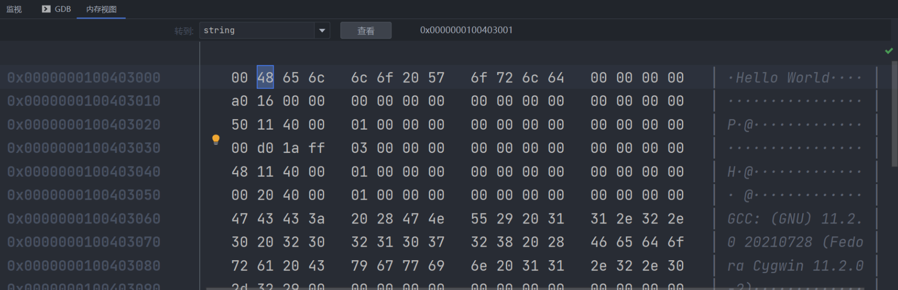
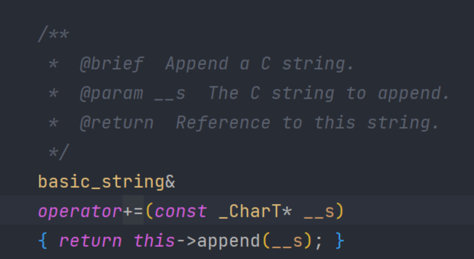
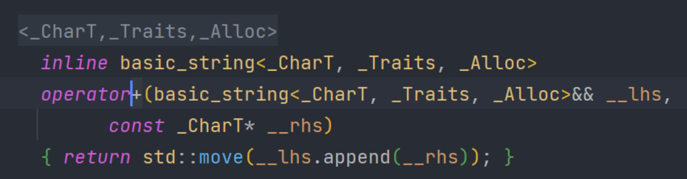

首先是字符，C++中字符占用一个字节，默认使用Ascii字符进行编码，字符串其实就是字符数组，数组是一组元素的集合

声明一个基本的字符串可以使用 `const char *name = ""`

```c++
#include <iostream>

int main() {
    const char *string = "Hello World";
    std::cout << string << std::endl;
    return 0;
}
```

这样创建的字符串是不在堆上的，所以不能使用delete进行操作

可以在debug模式下查看这个字符串在内存中实际的存储方式，其实就是一个个字符，我们可以看到，数组的末尾为00，这个是终止符，所以读取的时候是从指针的开头读取，一直读取到00终止



所以，我们还可以通过创建一个字符数组并手动初始化它

```c++
#include <iostream>

int main() {
    char string[11] = {'H', 'e', 'l', 'l', 'o', ',', 'w', 'o', 'r', 'l', 'd'};
    std::cout << string << std::endl;
    return 0;
}
```

当输出后，结果是

```
F:\Projects\ClionProjects\test\cmake-build-debug-cygwin\test.exe
Hello,world0���

进程已结束，退出代码为 0
```

出现问号的原因是没有写终止符号

修改为如下

```c++
#include <iostream>

int main() {
    char string[12] = {'H', 'e', 'l', 'l', 'o', ',', 'w', 'o', 'r', 'l', 'd', 0};
    std::cout << string << std::endl;
    return 0;
}
```

输出结果正确

```
F:\Projects\ClionProjects\test\cmake-build-debug-cygwin\test.exe
Hello,world

进程已结束，退出代码为 0
```

上面的属于c风格字符串

<hr>

我们可以使用std::string来创建字符串，下面是一些实例

```c++
#include <iostream>
#include <string>

std::string toString(bool test) {
    test ? "true" : "false";
}

int main() {
    //创建字符串
    std::string string = "Hello";
    std::cout << string << std::endl;
    //连接字符串
    string += " world";
    std::cout << string << std::endl;
    //或者这样
    std::string string1 = std::string("Hello ") + "world";
    std::cout << string1 << std::endl;
    //求是否包含
    bool test = string.find("He") != std::string::npos;
    std::cout << toString(test) << std::endl;
    return 0;
}
```

+= +实际上是string对操作符的一些重写





如果我们想写一个输出字符串的方法

```c++
std::string print(std::string message) {
    std::cout << message << std::endl;
}
```

很明显，我们这里只会对字符串进行读取操作，我们直接通过方法传递，会动态的在堆上分配char数组，并一个个复制，实际上是非常慢的

我们可以通过传递<font color="red">引用</font>并添加<font color="red">const</font>，表示我们不会对这个对象进行修改

```c++
std::string print(const std::string &message) {
    std::cout << message << std::endl;
}
```

string API http://www.cplusplus.com/reference/string/string/

<hr>
https://www.bilibili.com/video/BV1bf4y1e7ZB


<iframe src="//player.bilibili.com/player.html?aid=543569353&bvid=BV1bf4y1e7ZB&cid=276691378&page=1" scrolling="no" border="0" frameborder="no" framespacing="0" allowfullscreen="true" height="640"> </iframe>