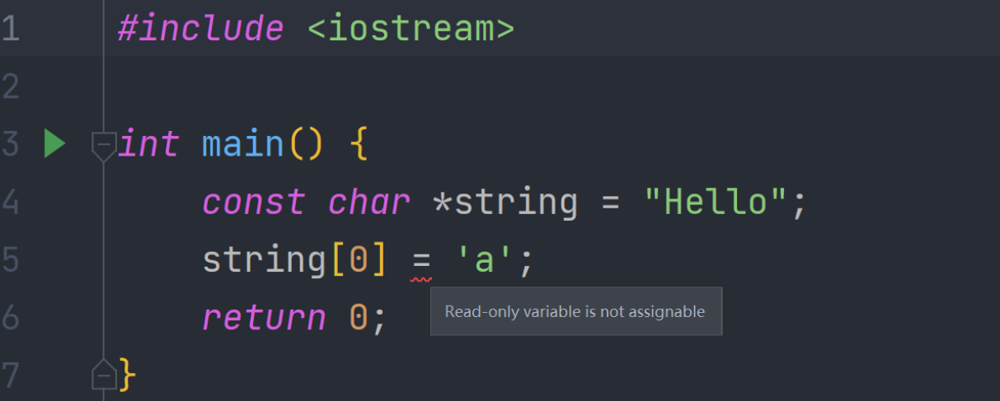
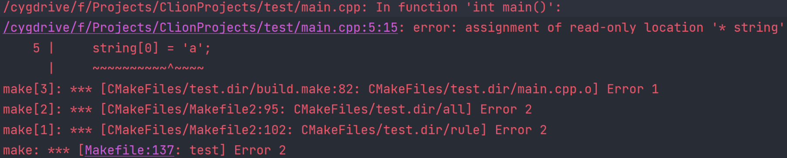
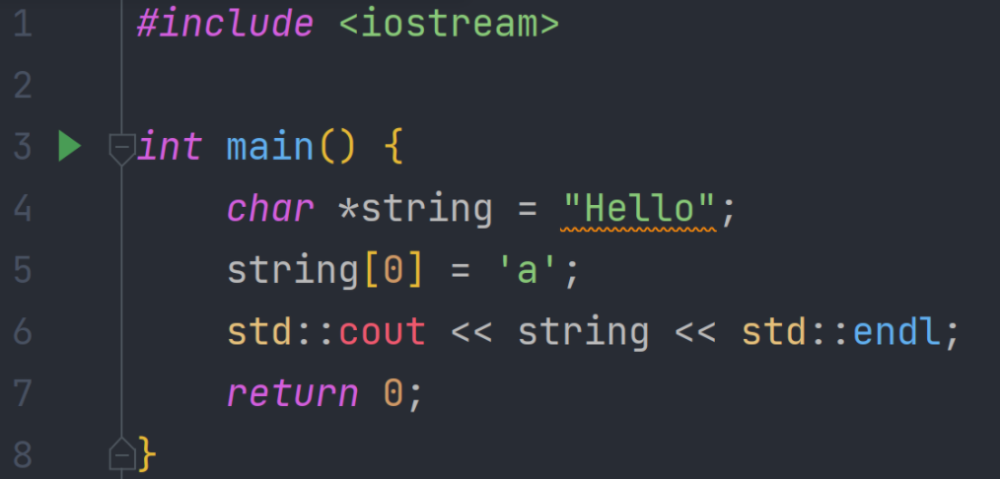
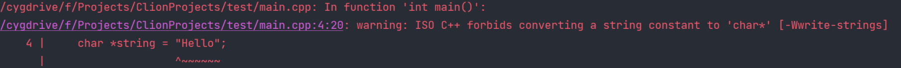
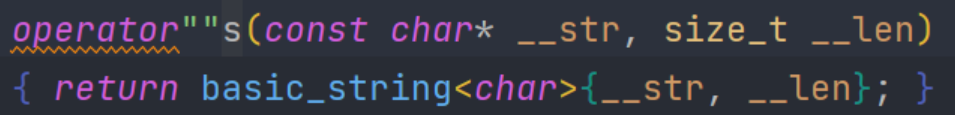

# 033-字符串字面量

声明一个字符串，我们不能尝试做出这样的行为



编译器也会报错



如果我们去掉const，部分编译器可能不会报错，但是运行也不会有修改的效果



我这里会警告：ISO C++ 禁止将字符串常量转换为 'char*' [-Wwrite-strings]，代码也不会运行



这里所做的操作是取了一个指向字符串字面量的一个指针，并尝试修改那个值，而字符串字面量位于内存的只读部分

如果我们非要修改，我们可以这样

```c++
#include <iostream>

int main() {
    char string[] = "Hello";
    string[0] = 'a';
    std::cout << string << std::endl;
    return 0;
}
```

运行结果也是正确的

```
F:\Projects\ClionProjects\test\cmake-build-debug-cygwin\test.exe
aello

进程已结束，退出代码为 0
```

这样实际上是在栈上创建了一个char类型的数组，并将Hello复制到这个数组，所以我们可以对它进行修改

下面是一些字符类型

```c++
#include <iostream>

int main() {
    //这些都属于c风格字符串
    //char类型 一个字节的字符 utf-8
    const char *s1 = u8"Hello";
    //前面添加L表示它是宽字符
    //长度实际上是由编译器决定
    //可能是一个也可能是两个 也可能是四个
    //貌似在windows上是两个 在linux上是4个
    const wchar_t *s2 = L"Hello";
    //上面是c的

    //下面是c++引入的
    //两个字节的字符 utf-16
    const char16_t *s3 = u"Hello";
    //四个字节的字符 utf-32
    const char32_t *string = U"Hello";
    std::cout << sizeof(wchar_t) << std::endl;
    return 0;
}


```

c++14中引入了string_literals，可以通过在字符串字面量后面添加s将其转换为std::string

```c++
#include <iostream>

int main() {
    using namespace std::string_literals;
    std::string s = "Hello"s + " World";
    return 0;
}

```

这个s实际是个操作符



下面应该是c++的字符串类型

```c++
#include <iostream>

int main() {
    std::u32string s1 = U"Hello";
    std::u16string s2 = u"Hello";
    std::wstring s3 = L"Hello";
    std::string s4 = u8"Hello";
    return 0;
}
```

用R"(这里面的字符串可以直接写，写啥就是啥，比如回车就不用\n)"，例如

```c++
#include <iostream>

int main() {
    std::string s = R"(He
l
lo)";
    std::cout << s << std::endl;
    return 0;
}
```

```
F:\Projects\ClionProjects\test\cmake-build-debug-cygwin\test.exe
He
l
lo

进程已结束，退出代码为 0
```

我们需要知道，字符串字面量是不能进行修改的，因为它永远位于内存的只读区域。

我觉得直接用std::string即可

**********


这些是我的发现

字符串字面量就是"这就是字符串字面量"

字符串字面量可以赋值给

const char *name，像这样

const char *str = "Hello"

也可以直接给 std::string name，像这样

std::string str = "Hello"

但是const char * 和std::string是不一样的，前者是c风格字符串，后者是c++的类库，属于c++的字符串

如果一个函数的参数是const char *，直接传std::string是不行的，需要调用std::string的c_str()方法

但是const char * 可以直接给std::string参数 这个实际上是一次隐式转换？参照040节

************


注意：c++中的字符串字面量不是std::string的对象，字符串字面量和std::string不一样

字符串字面量其实是const char * c风格字符串

*********
[https://www.bilibili.com/video/BV1iz4y1z7wT](https://www.bilibili.com/video/BV1iz4y1z7wT)

