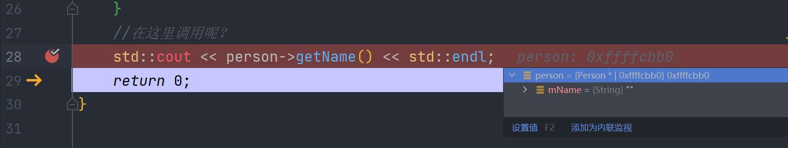
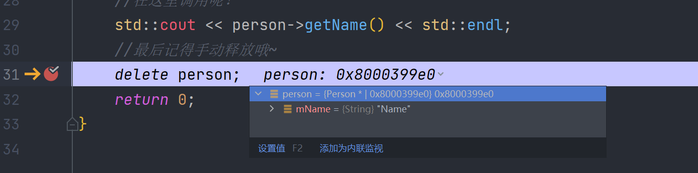

# 038-创建并初始化C++对象

程序一般会将内存分为两部分，栈和堆，还有其他部分的内存如源代码的区域

创建对象有两种方式，在栈上或者堆上创建

###### 在栈上创建

在栈上创建的对象有一个自动的生存期，这个生存期实际上是由它声明的地方的作用域决定，超出这个作用域，内存就会被释放，因为作用域结束后，栈会弹出，栈上的东西都会被释放。

###### 在堆上创建

在堆上创建的对象，它会一直在那，除非手动删除这个对象。


如何在栈上创建呢？例如

```c++
#include <iostream>


using String = std::string;


class Person {
private:
    String mName;
public:
    Person() : mName("Unknown") {}

    Person(const String &name) : mName(name) {}

    const String &getName() const {
        return mName;
    }
};

int main() {
    //使用无参构造器初始化
    Person person1;
    Person person2 = Person();
    //使用有参构造器初始化
    Person person3("Name");
    Person person4 = Person("Name");
    return 0;
}
```

一般都使用这种方式，因为这是最快的创建方式，也容易管控，但是，某些情况下，我们不能这样做

```c++
int main() {
    Person *person;
    {
        //如果我们在这个作用域内为上面的指针赋值对象呢
        Person p("Name");
        person = &p;
    }
    //在这里调用呢？
    std::cout << person->getName() << std::endl;
    return 0;
}
```

如果在上面的第9行处调用方法呢？



我们可以看到，mName实际上是空的，因为出了作用域，这个对象已经被释放了，所以我们可以在堆上分配

因为我们栈的空间是比较小的，可能只有1M 2M？这个应该是编译器决定的

我们可以将上面的例子修改到堆上分配，如下

```c++
int main() {
    Person *person;
    {
        //我们使用new来创建一个对象
        Person *p = new Person("Name");
        //赋值给上面的指针
        person = p;
    }
    //在这里调用呢？
    std::cout << person->getName() << std::endl;
    //最后记得手动释放哦~
    delete person;
    return 0;
}
```

我们debug看看



可以看到，在delete之前，这个对象都还在哦~

务必需要知道，我们使用new创建出来的对象，一定一定要手动释放内存，要不会造成内存泄漏


那么什么时候要在栈上分配对象？什么时候在堆上分配对象呢？

一般我们都要在栈上分配，除非

- 这个对象规模过大或者过多的对象

- 需要手动管控它的生存周期

我们才在堆上分配

在栈上分配，速度快，而且可以自动管控对象的生存期，而在堆上分配，还需要自己释放内存，一不小心就会内存泄漏

后面会提到智能指针，可以解决上面的问题~

<hr>

[https://www.bilibili.com/video/BV1o54y1x7jk](https://www.bilibili.com/video/BV1o54y1x7jk)

<div style="position: relative; width: 100%; padding-top: calc(100% * 1200 / 1600); position: unset;">
    <iframe src="//player.bilibili.com/player.html?bvid=BV1o54y1x7jk" style="position: absolute; width: 100%; height: 100%; top: 0;"></iframe>
</div>