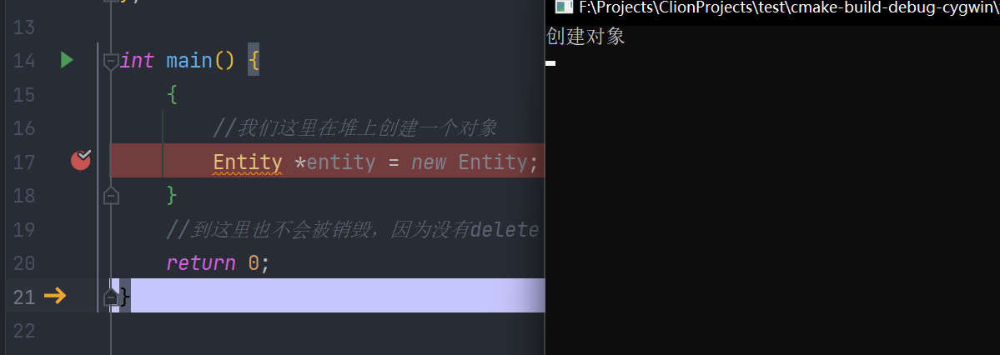

# 043-对象生存期（栈作用域生存期）

我们在栈上创建对象，出了作用域就会被销毁，例如

```c++
#include <iostream>

class Entity {
public:
    Entity() {
        std::cout << "创建对象" << std::endl;
    }

    ~Entity() {
        std::cout << "销毁对象" << std::endl;
    }
};

int main() {
    {
        //我们这里在栈上创建一个对象
        Entity entity;
    }
    //到这里就会被销毁
    return 0;
}
```

我们添加断点并使用debug模式来运行


如果在堆上创建，出了作用域也不会销毁，除非手动delete

```c++
int main() {
    {
        //我们这里在堆上创建一个对象
        Entity *entity = new Entity;
    }
    //到这里也不会被销毁，因为没有delete
    return 0;
}
```

我们添加断点后debug模式运行




可以看到，最后也没有被销毁，因为没有手动delete

通过上面的例子我们可以看到在栈上创建对象和堆上创建对象的区别

看下面的例子

```c++
int *createArr() {
    int arr[50];
    return arr;
}
```

如果我们调用这个方法来创建数组，完全就<font color="red">错误</font>了，因为出了这个方法，创建的数组就会被销毁，无法再次使用

如果想利用这种办法创建数组，我们可以使用new或者将变量放在外面

这种特性在各种方面都非常有用，可以帮助我们自动化代码，我们可以利用类的作用域例如智能指针smart_prt或者unique_ptr（这是一个作用域指针）或者像作用域锁（scoped_lock）

最简单的例子是作用域指针它本质上是一个类，它是一个指针的包装器，在构造时分配指针，在析构时释放指针，看下面的例子

```c++
#include <iostream>

class Entity {
public:
    Entity() {
        std::cout << "创建对象" << std::endl;
    }

    ~Entity() {
        std::cout << "销毁对象" << std::endl;
    }
};

class ScopedPtr {
private:
    Entity *mPtr;
public:
    ScopedPtr(Entity *entity) : mPtr(entity) {

    }

    ~ScopedPtr() {
        delete mPtr;
    }
};


int main() {
    {
        //在堆上创建一个Entity
        ScopedPtr scopedPtr = new Entity();
    }
    //结束时因为ScopedPtr析构，会自动销毁
    return 0;
}
```

通过包装一个指针，利用出了作用域会自动析构的特性，删除分配的ptr

我们加上断点以debug模式运行一下


可以看到，在出了绿色花括号作用域后，我们的对象被销毁

通过这种特性，我们可以编写计时器自动计时，编写互斥锁自动释放等~

*******

[https://www.bilibili.com/video/BV1xy4y1m7F7](https://www.bilibili.com/video/BV1xy4y1m7F7)