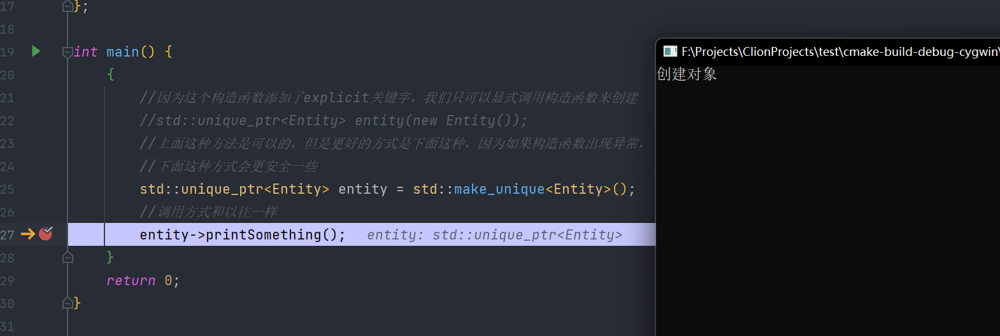
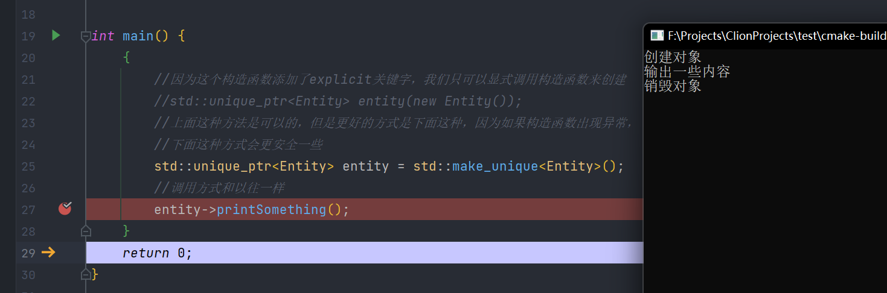
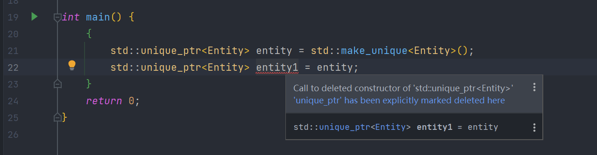
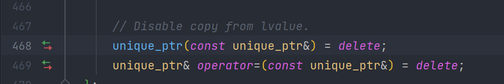
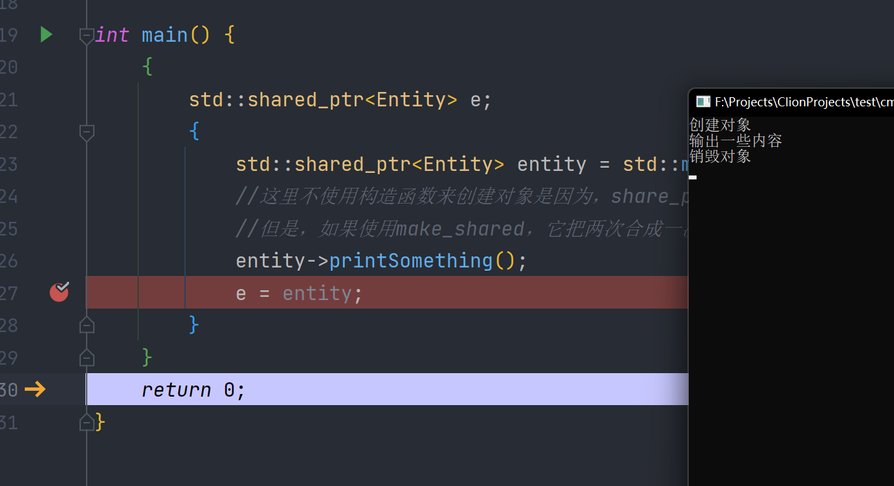
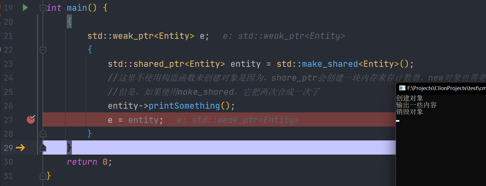

# 044-智能指针

以往调用new在堆上创建对象后，都需要调用delete对内存进行释放，否则会造成内存泄漏，但是如果使用了智能指针，这个过程会自动化，也就是我们new完之后，不需要手动调用delete，甚至可以不用new

智能指针实际上是对原始指针的一个封装

我们来看第一个智能指针

#### unique_ptr

这是一个作用域指针，超出作用域后，它会被销毁，然后调用delete。

为啥它叫unique指针呢，它是唯一的吗？

No，因为你不能复制一个unique_ptr，因为你如果复制一个，它们俩都指向一块内存，也就是你有俩指针，俩都指向一块内存，一个释放了，会delete那块内存，指向同一块内存的另一个指针指向了一个被释放的内存，所以你不能复制这个指针。

我们来看一个unique_ptr的例子

要使用unique_ptr，我们需要include memory

```c++
#include <iostream>
#include <memory>

class Entity {
public:
    Entity() {
        std::cout << "创建对象" << std::endl;
    }

    ~Entity() {
        std::cout << "销毁对象" << std::endl;
    }

    void printSomething() {
        std::cout << "输出一些内容" << std::endl;
    }
};

int main() {
    {
        //因为这个构造函数添加了explicit关键字，我们只可以显式调用构造函数来创建
        //std::unique_ptr<Entity> entity(new Entity());
        //上面这种方法是可以的，但是更好的方式是下面这种，因为如果构造函数出现异常，
        //下面这种方式会更安全一些
        std::unique_ptr<Entity> entity = std::make_unique<Entity>();
        //调用方式和以往一样
        entity->printSomething();
    }
    return 0;
}
```

以debug方式运行，我们可以看到，出了作用域，我们的对象会被析构





另外，这个对象是不能被复制的



在定义中我们可以看到，拷贝构造函数和拷贝构造操作符被删除了



#### share_ptr

 share_ptr的实现方式一般是引用计数，每多一次引用，计数器就+1，少一次就-1，直到归零，就delete释放内存，看下面的例子

```c++
#include <iostream>
#include <memory>

class Entity {
public:
    Entity() {
        std::cout << "创建对象" << std::endl;
    }

    ~Entity() {
        std::cout << "销毁对象" << std::endl;
    }

    void printSomething() {
        std::cout << "输出一些内容" << std::endl;
    }
};

int main() {
    {
        std::shared_ptr<Entity> e;
        {
            std::shared_ptr<Entity> entity = std::make_shared<Entity>();
            //这里不使用构造函数来创建对象是因为，share_ptr会创建一块内存来存计数器，new对象也需要创建一次内存，就得两次
            //但是，如果使用make_shared，它把两次合成一次了
            entity->printSomething();
            e = entity;
        }
    }
    return 0;
}
```


可以看到，出了蓝色花括号，对象依然没有析构，因为这时依然有一个引用牵连着对象，不会析构



出了绿色花括号，对象被析构，内存释放。

我们还存在一种弱引用`weak_ptr`，弱引用不会和增加引用计数器

我们把外层引用修改为弱引用试试



可以看到，出了蓝色花括号，对象就被销毁了~

你可以调用`expired()`来询问`weak_ptr`指针是否过期

我们其实应该一直使用智能指针，因为它可以帮助我们管理内存，即使share_ptr因为内存计数系统有一些开销。

我们应该尽量使用unique_ptr，因为开销较小~

****

[https://www.bilibili.com/video/BV1hv411W7kX](https://www.bilibili.com/video/BV1hv411W7kX)
