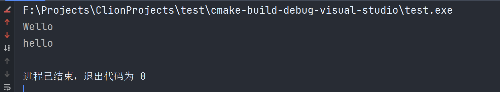

# 045-复制与拷贝构造函数

有时候，我们需要把一个对象从一个地方复制到另一个地方，进行一些操作，但有的时候，我们只是希望读取一个对象的值，我们需要避免复制，所以我们需要了解c++的复制是如何工作的

看下面的一些例子

```c++
int main() {
    //创建一个变量a赋值为5
    int a = 5;
    //创建一个变量b 将a的值赋值于b 这时a和b是两个独立且不同的变量
    int b = a;
    //所以这里修改b的值为5，并不会修改a，因为它们是相互独立的
    b = 8;
    return 0;
}
```

```c++
struct Position {
    float x;
    float y;
};

int main() {
    Position p1 = Position{5, 8};
    //这里也是复制了p1的值，p1和p2在内存中也是不同的地址
    Position p2 = p1;
    //这里修改p2的x，也不会修改p1的值，p1该是多少还是多少
    p2.x = 9;
    return 0;
}
```

如果使用new来创建对象呢

```c++
#include <iostream>

struct Position {
    float x;
    float y;

};

int main() {
    //首先我们先new一个Position
    Position *p1 = new Position{5, 8};
    //这里将p1复制到p2，这里实际上复制的是指针的地址
    Position *p2 = p1;
    //现在他们两个指针的指向是相同的
    //如果我们修改p2
    //例如p2++，这里我们只是修改了p2的指向，p1并不会发生变化
    p2++;
    //如果我们修改p2指向的内容的值，p1会发生变化，因为它们指向了同一个对象
    p2->x = 9;
    return 0;
}
```

当我们使用赋值操作符`=`将一个变量设置为另一个变量时，我们“总是”在复制值，这里的总是除了引用，因为你把一个引用赋值到另一个引用，你其实是在改变指向，因为引用只是别名，没有复制这一说。所以我们将一个变量赋值给另一个变量，总是在复制值，如果是指针，就是复制指针，也就是内存地址，其实就是数字，而不是指针指向的实际内存。

下面是一个关于字符串的例子

```c++
#include <iostream>
#include <string>
#include <cstring>

class String {
private:
    char *mBuffer;
    unsigned int mSize;
public:
    String(const char *string) {
        mSize = strlen(string);
        mBuffer = new char[mSize + 1];
        memcpy(mBuffer, string, mSize);
        //为最后一位添加结束符
        mBuffer[mSize] = 0;
    }

    ~String() {
        //在这里我们将mBuffer内存释放
        delete mBuffer;
    }

    friend std::ostream &operator<<(std::ostream &ostream,const String &string);

};

std::ostream &operator<<(std::ostream &ostream,const String &string) {
    ostream << string.mBuffer;
    return ostream;
}

int main() {
    String s0 = "hello";
    String s1 = s0;
    std::cout << s0 << std::endl;
    std::cout << s1 << std::endl;
    return 0;
}
```

看上面的例子，我们创建一个自己的字符串类，在构造函数中我们分配内存，在析构函数中我们释放内存，我们还重载了<<操作符，接着main函数中我们创建一个字符串s0，并复制到s1并分别输出他们，看起来没有什么问题，但是当我们运行的时候，我们除了输出了两次hello，还会收到一个错误。


我们如果在运行的时候修改s0的mBuffer呢？

为了便于操作，我们可以重载[]

```c++
char &operator[](unsigned int index) {
    return mBuffer[index];
}
```

并在main函数中进行这样的操作

```c++
int main() {
    String s0 = "hello";
    String s1 = s0;
    s0[0] = 'W';
    std::cout << s0 << std::endl;
    std::cout << s1 << std::endl;
    return 0;
}
```

运行一下


两个都被修改了

为什么？

我们创建的s0复制到s1，走的是拷贝构造函数，拷贝构造函数的默认实现是这样的。

```c++
String(const String &other) : mBuffer(other.mBuffer), mSize(other.mSize) {
}
```

其实mBuffer实际上是个指针，照着我们一开始的逻辑来分析，新的对象只是把指针指向的值复制过去了，也就是所谓的浅拷贝，在s0析构的时候，已经将mBuffer指向的地址的值那块内存释放，s1如果再释放一遍，必然会出问题，所以，我们可以对字符串进行深拷贝，也就是整一个新的数组，将一个个值都复制过去，像下面这样

```c++
String(const String &other) {
    mSize = other.mSize;
    mBuffer = new char[mSize + 1];
    memcpy(mBuffer, other.mBuffer, mSize + 1);
}
```

这样，我们进行了深拷贝，我们将对象的所有值都复制过去，如果修改一个对象，另一个也不会变化，而且在最后也不会出现多次释放同一块内存的问题，最后我们的代码是这样的

```c++
#include <iostream>
#include <string>
#include <cstring>

class String {
private:
    char *mBuffer;
    unsigned int mSize;
public:
    String(const char *string) {
        mSize = strlen(string);
        mBuffer = new char[mSize + 1];
        memcpy(mBuffer, string, mSize);
        //为最后一位添加结束符
        mBuffer[mSize] = 0;
    }

    ~String() {
        //在这里我们将mBuffer内存释放
        delete mBuffer;
    }

    String(const String &other) {
        mSize = other.mSize;
        mBuffer = new char[mSize + 1];
        memcpy(mBuffer, other.mBuffer, mSize + 1);
    }

    char &operator[](unsigned int index) {
        return mBuffer[index];
    }

    friend std::ostream &operator<<(std::ostream &ostream,const String &string);

};

std::ostream &operator<<(std::ostream &ostream,const String &string) {
    ostream << string.mBuffer;
    return ostream;
}

int main() {
    String s0 = "hello";
    String s1 = s0;
    s0[0] = 'W';
    std::cout << s0 << std::endl;
    std::cout << s1 << std::endl;
    return 0;
}
```

运行结果不出所料，也是正确的



如果我们不希望我们这个对象被复制，我们可以删除拷贝构造函数，像这样

```c++
String(const String &other)  = delete;
```

这样，我们的对象就不能被复制了


针对参数传递，我们还需要知道一件事情

```c++
void print(String string) {
    std::cout << string << std::endl;
}

int main() {
    String s0 = "hello";
    String s1 = s0;
    print(s0);
    print(s1);
    return 0;
}
```

我们写一个print函数并将之前的输出修改为调用新写的函数，会有问题吗？我们为拷贝构造函数里面加一些日志，来观察


可以看到，进行了三次拷贝？？？

因为我们调用print方法的时候，会复制一次字符串，简直太荒谬了，我们不需要这样，我们可以传递字符串的引用，这样就不会进行多次复制了，像下面这样。

```c++
//因为这个方法实际上不会修改我们的string，所以我们可以添加const
void print(const String &string) {
    std::cout << string << std::endl;
}
```

我们再次运行


只进行了一次拷贝，正常多了

需要知道，我们应该总是使用const引用去传递对象，因为可以避免到处复制一个对象。

***

[https://www.bilibili.com/video/BV13T4y1P7tw](https://www.bilibili.com/video/BV13T4y1P7tw)
