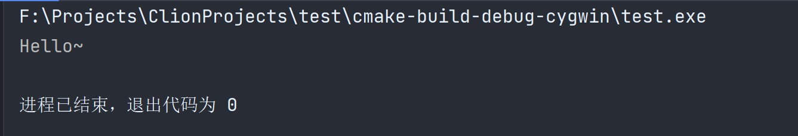
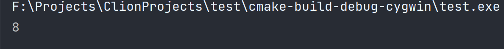

# 046-箭头操作符

如果我们有一个对象，我们想要调用对象的某个方法，我们可以使用`.`来进行调用，像下面这样

```c++
#include <iostream>

class Entity {
public:
    void print() {
        std::cout << "Hello~" << std::endl;
    }
};

int main() {
    Entity entity;
    entity.print();
    return 0;
}
```

那如果我们拿到的是个指针呢，比如我们在堆上分配了对象，或者是对对象取了地址

像这样

```c++
Entity *entity1 = &entity;
```

因为是指针，我们实际上是不能直接调用方法的，因为指针其实只是个数字，我们需要对我们的对象解引用后才能调用，像这样

```c++
(*entity1).print();
```

但是，这玩意看起来咋这么不好看呢，又是括号又是*的，这个时候，我们就可以使用箭头操作符来简化这个过程了，像这样

```c++
entity1->print();
```

是不是看起来简单多了，在c++中，90%的箭头都是这么用的，因为这个是个操作符，所以我们可以重载它，接下来是一个例子

我们编写一个特别简单的智能指针，ScopePtr，像下面这样

```c++
class ScopePtr {
private:
    Entity *mObj;
public:
    ScopePtr(Entity *mObj) : mObj(mObj) {

    }

    ~ScopePtr() {
        delete mObj;
    }
};
```

我们然后我们使用它

```c++
ScopePtr scopePtr = new Entity();
```

这个时候，我们想调用entity的print方法，怎么调？

最简单的，我们可以为ScopePtr添加一个getObj方法，拿到对象，然后再调用，就好了，但是，这好吗？不好，我希望我们能直接调用这个方法。

```c++
Entity *operator->() {
    return mObj;
}
```

我们重载->操作符，这样我们就可以像之前那样直接调用了，为了防止调用该箭头操作符的对象是个const修饰的，我们还应该再提供一个const版本

```c++
Entity *operator->() const {
    return mObj;
}
```
现在，我们就可以像之前一样调用->了，像下面这样

```c++
int main() {
    ScopePtr scopePtr = new Entity();
    scopePtr->print();
    return 0;
}
```
运行起来也一切正常



我们看到，重载后的箭头操作符返回的是Entity的指针，那为什么还能直接调用呢？

这里我们参照C++ Primer的一些解释，就明白了

> ### 对箭头运算符返回值的限定
>
> 和大多数其他运算符一样(尽管这么做不太好)，我们能令operator\*完成任何我们指定的操作。换句话说，我们可以让operator\*返回一个固定值42，或者打印对象的内容，或者其他。箭头运算符则不是这样，它永远不能丢掉成员访问这个最基本的含义。当我们重载箭头时，可以改变的是箭头从哪个对象当中获取成员，而箭头获取成员这一事实则永远不变。 对于形如point->mem的表达式来说，point必须是指向类对象的指针或者是一个重载了operator->的类的对象。根据point类型的不同，point->mem分别等价于 
>
> ```c++
> (*point).mem;            //point是一个内置的指针类型
> point.operator()->mem;   //point是类的一个对象
> ```
>
> 除此之外，代码都将发生错误。point->mem的执行过程如下所示：
>
> 1. 如果point是指针，则我们应用内置的箭头运算符，表达式等价于(\*point).mem。首先解引用该指针，然后从所得的对象中获取指定的成员。如果point所指的类型没有名为mem的成员，程序会发生错误。
>
> 2. 如果point是定义了operator->的类的一个对象，则我们使用point.operator->() 的结果来获取mem。其中，如果该结果是一个指针，则执行第1步；如果该结果本身含有重载的operator->(),则重复调用当前步骤。最终,当这一过程结束时程序或者返回了所需的内容，或者返回一些表示程序错误的信息。
>
>    > 重载的箭头运算符必须返回类的指针或者自定义了箭头运算符的某个类的对象。

下面是一些额外的内容，如何使用箭头操作符获取内存中某个成员变量的偏移量

```c++
struct Vector3 {
    float x;
    float y;
    float z;
};
```

如果我们有一个结构体，我们里面有三个成员变量，x、y、z，这些成员变量的偏移量分别是0、4、8

我们如何通过代码获取呢？

可以这样

```c++
long i = (long) (&(((Vector3 *) 0)->z));
std::cout << i << std::endl;
```

是不是看起来花里胡哨的，其实非常简单，我们将0作为对象的起始地址，强制转换为我们的结构体指针类型，然后获取某个变量，再取它的地址，再强制转换为long类型，也就是它的地址，这样就可以拿到偏移量。

输出结果为



***

[https://www.bilibili.com/video/BV1X5411E77g](https://www.bilibili.com/video/BV1X5411E77g)
