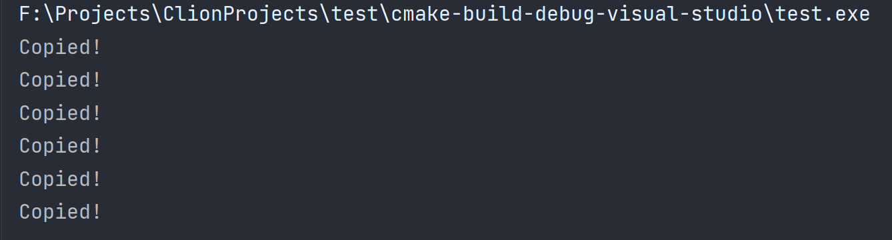
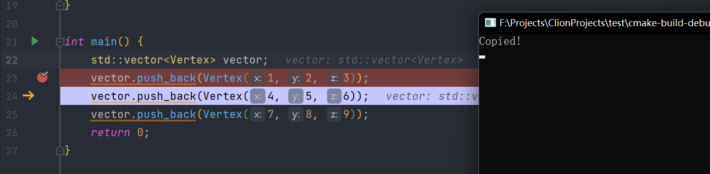
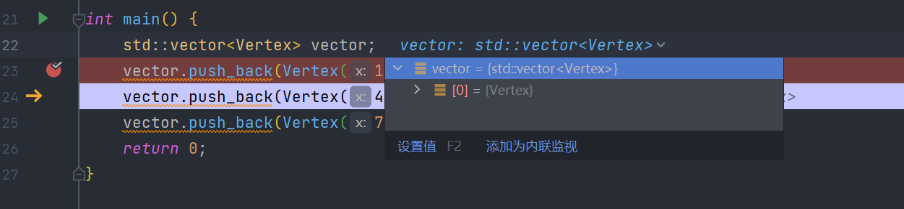
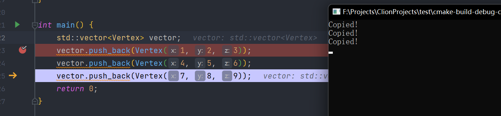
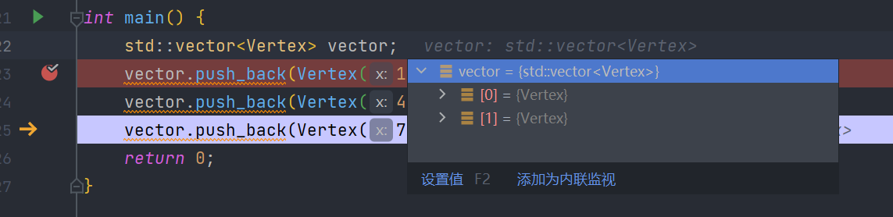
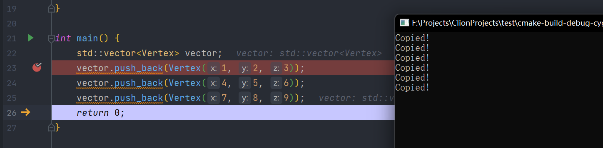
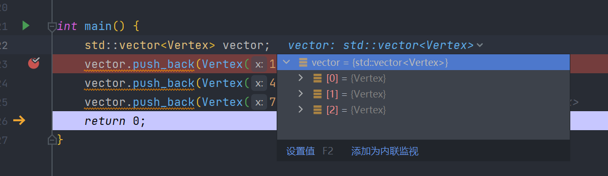

# 048-Vector优化

如果我们在Vector中存储的是对象而不是对象的指针，当push_back的时候，如果容量满了，就会进行扩容，扩容的时候会将之前的所有对象复制到新创建的数组里面，复制这个过程是比较耗时的，我们应该避免复制，那么复制发生在什么时候呢？我们可以为我们要添加到Vector里面的对象添加一个拷贝构造函数，进行观察

```c++
#include <iostream>
#include <vector>

struct Vertex {
    float x;
    float y;
    float z;

    Vertex(float x, float y, float z) : x(x), y(y), z(z) {}

    Vertex(const Vertex &other) : x(other.x), y(other.y), z(other.z) {
        std::cout << "Copied!" << std::endl;
    }
};

std::ostream &operator<<(std::ostream &ostream, const Vertex &vertex) {
    ostream << vertex.x << "," << vertex.y << "," << vertex.z;
    return ostream;
}

int main() {
    std::vector<Vertex> vector;
    vector.push_back(Vertex(1, 2, 3));
    vector.push_back(Vertex(4, 5, 6));
    vector.push_back(Vertex(7, 8, 9));
    return 0;
}
```

如果我们写这样的代码进行运行



震惊，居然输出了6次，也就是我们放三次对象，就会产生6次复制

为什么？

我们加断点试试

第一行添加后





一次添加就会复制一次，这是因为我们在main函数这边创建了Vertex，push_back的时候，我们将对象复制过去，所以每次添加都会有一次复制

第二行添加后





第三行添加后





后面两次添加，我们可以看到，会有更多的复制，还可以看到数组在一次次变大，这是因为扩容导致的

综合上面的两种情况，我们可以这样优化，首先，我们可以将对象创建挪到vector里面去，我们将需要添加的数据传递过去，让vector进行创建并添加，第二，我们可以为vector指定一个初始的值，不要每次都在这扩容，将上面的代码可以修改为

```c++
int main() {
    std::vector<Vertex> vector;
    //使用这个方法可以预先创建三个空间
    vector.reserve(3);
    //使用emplace_back可以将对象的创建挪到vector里面
    vector.emplace_back(1, 2, 3);
    vector.emplace_back(4, 5, 6);
    vector.emplace_back(7, 8, 9);
    return 0;
}
```

这样运行后，一次复制操作都没有了，加快了运行速度

***

[https://www.bilibili.com/video/BV1rh411y7cx](https://www.bilibili.com/video/BV1rh411y7cx)