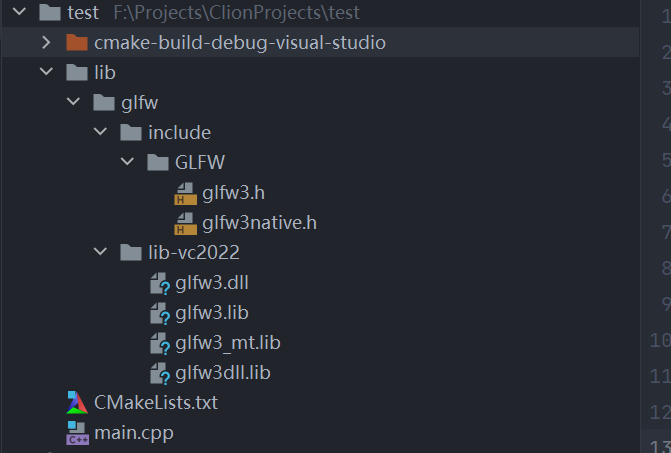
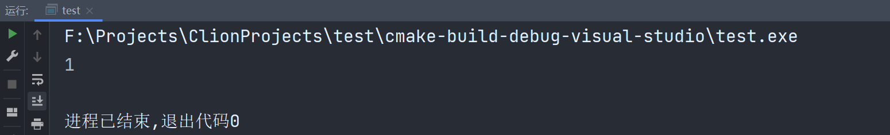

# 049-使用库-静态链接

我这使用的是cmake，我们导入GLFW这个库，我这里采用工具链为visual studio2022 选择的库也是vc2022，首先下载已经预编译的文件，放到项目下面



在CMakeLists.txt里面这样写

```cmake
cmake_minimum_required(VERSION 3.19)
project(test)

set(CMAKE_CXX_STANDARD 14)

add_library(GLFW SHARED IMPORTED)
include_directories(lib/glfw/include)
set_target_properties(GLFW PROPERTIES IMPORTED_LOCATION ${CMAKE_CURRENT_SOURCE_DIR}/lib/glfw/lib-vc2022/glfw3.dll)
set_target_properties(GLFW PROPERTIES IMPORTED_IMPLIB ${CMAKE_CURRENT_SOURCE_DIR}/lib/glfw/lib-vc2022/glfw3.lib)

add_executable(test main.cpp)

target_link_libraries(test GLFW)
```

```c++
#include <iostream>
#include <GLFW/glfw3.h>

int main() {
    int i = glfwInit();
    std::cout << i << std::endl;
    return 0;
}
```

运行结果



***

[https://www.bilibili.com/video/BV1vp4y1W7ze](https://www.bilibili.com/video/BV1vp4y1W7ze)
