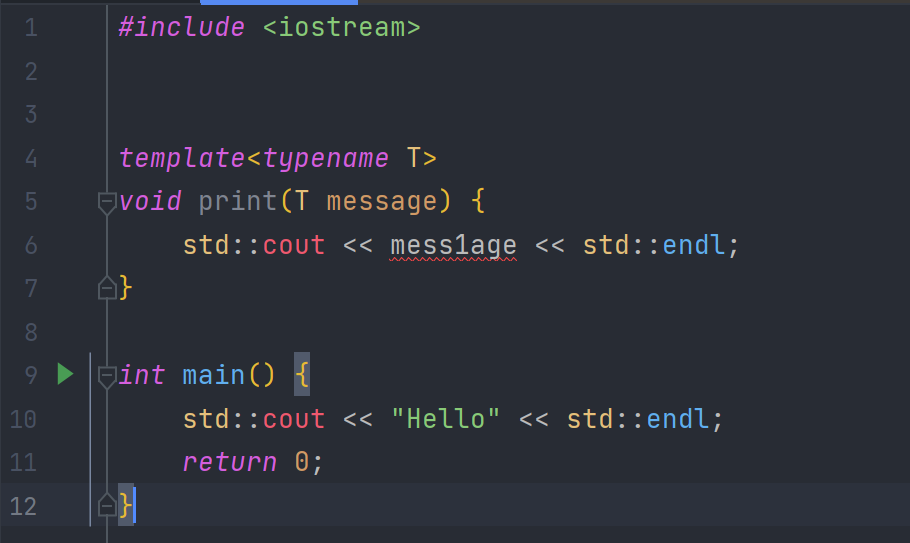
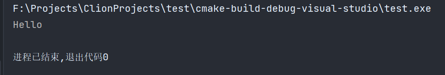

# 053-模板

c++中的模板和Java中的泛型类似，但是功能更加强大，它有点像宏

模板允许你定义一个可以根据你的用途进行编译的模板，如果是有意义的话，你可以让编译器为你基于一套规则写代码

例如，当我写一个函数时，我在这个函数里面使用模板，我实际在做的是，创建一个蓝本，因此当我决定要调用这个函数时，我可以指定特定的参数，这个参数决定了放入到模板中实际的代码，这些就决定了我实际如何使用这个函数

看下面一个例子

```c++
#include <iostream>
#include <string>


void print(std::string message) {
    std::cout << message << std::endl;
}

void print(int message) {
    std::cout << message << std::endl;
}

void print(float message) {
    std::cout << message << std::endl;
}

int main() {
    print("Hello");
    print(123456);
    print(123.456f);
    return 0;
}
```

如果我们想要输出一些信息，但是这些信息是不同类型的，我们可以通过重载一个方法来实现

```c++
#include <iostream>

template<typename T>
void print(T message) {
    std::cout << message << std::endl;
}

int main() {
    print("Hello");
    print(123456);
    print(123.456f);
    return 0;
}
```

但是我们可以是用模板来简化这个操作

> 这里的`typename`也可以写成`class`，两个是同义词

> 其实Java里面也可以，哈哈哈
>
> ```java
> private static <T> void print(T message) {
>     System.out.println(message);
> }
> ```

上面的类型都是隐式的，我们可以显示指定模板的类型，像下面这样

```c++
#include <iostream>


template<typename T>
void print(T message) {
    std::cout << message << std::endl;
}

int main() {
    print<std::string>("Hello");
    print<int>(123456);
    print<float>(123.456f);
    return 0;
}
```

这个模板在我们没有调用的时候，其实是不存在这段代码的，只有我们调用了，才会在编译时期生成，如果使用MSVC编译器，即使在模板中编写错误的代码，在编译的时候，只要没有调用，甚至都不会报错，像下面这样





在编译的时候，编译器会根据实际调用进行填空，将传递的类型分别为模板填空，并生成对应的方法。

模板不仅可以使用在方法上，还可以使用在类上

像下面这样

```c++
#include <iostream>
#include <string>

template<typename T, int size>
class Array {
private:
    T mArray[size];
public:
    int length() {
        return size;
    }

    T &operator[](int index) {
        return mArray[index];
    }
};

int main() {
    Array<std::string, 5> array;
    for (int i = 0; i < array.length(); i++) {
        array[i] = std::string("string") + std::to_string(i);
    }
    for (int i = 0; i < array.length(); ++i) {
        std::cout << array[i] << std::endl;
    }
    return 0;
}
```

上面的例子中，我们创建了我们的Array模板，通过使用这个模板，我们可以创建一个任意类型、任意长度的数组，和标准库的Array很类似😂

***

[https://www.bilibili.com/video/BV1Hr4y1N7TR](https://www.bilibili.com/video/BV1Hr4y1N7TR)
