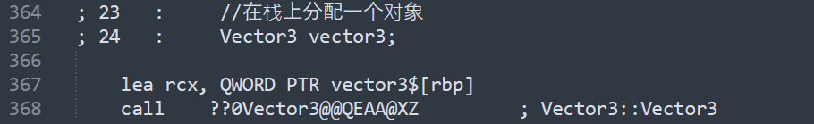

# 054-栈与堆内存的比较

当我们的程序开始运行的时候，它们被分成了一堆不同的内存区域，除了栈和堆以外，还有很多东西，但是我们目前只需要关注栈和堆，在应用程序启动后，操作系统需要干的事情是将我们的整个应用程序加载到内存，并分配一堆物理ram，让我们的程序能够正常运行。

栈和堆是在物理ram上真实存在的两块区域，栈通常是预定义大小的内存区域，通常由2兆字节左右，堆也是预定义了默认值的区域，但是它可以增长，随着应用程序的进行而改变，要知道，两块区域都在ram上。

它们的工作原理虽然不同，但是本质上做的事情都是一样的，我们可以要求c++给我们从栈或者堆中分出一些内存，顺利的话，他会给我们分一块我们要求的内存块，它们的不同之处在于如何为我们分配内存，比如我们想要一个int值，一般都是4个字节，我们能找到由四个字节组成的连续的内存块，栈和堆给我们的内存的方式是不同的，当我们像这样要求内存的时候，这就叫做内存分配。

下面是一个例子

```c++
#include <iostream>


struct Vector3 {
    float x;
    float y;
    float z;

    Vector3() : x(10), y(11), z(12) {}
};

int main() {
    //这就是在栈上分配内存，并将其赋值为5
    int value = 5;
    //在栈上分配一个数组
    int arr[5];
    //并进行赋值
    arr[0] = 1;
    arr[1] = 2;
    arr[2] = 3;
    arr[3] = 4;
    arr[4] = 5;
    //在栈上分配一个对象
    Vector3 vector3;

    //这样是在堆上分配内存
    int *hValue = new int;
    //解引用，并赋值为5
    *hValue = 5;
    //在堆上分配一个数组
    int *hArr = new int[5];
    hArr[0] = 1;
    hArr[1] = 2;
    hArr[2] = 3;
    hArr[3] = 4;
    hArr[4] = 5;
    //在堆上分配一个对象
    Vector3 *hVector3 = new Vector3();
    delete hValue;
    delete[] hArr;
    delete hVector3;

    return 0;
}
```

我们添加断点一行一行看


现在，我们value位置的值为cccccccc，执行完这行后


value被填充为5

接着看arr的数据


我们将每一行执行完成后，arr被挨着赋值为12345


接着我们去找我们的vector3


执行完成后，我们可以看到vector3被赋值


我们还可以发现，这堆东西它们都在一块，中间隔着内存守卫，这个东西只会在debug的时候出来，防止修改一些不改修改的值

当我们在栈上分配变量的时候，发生的是，栈指针，也就是栈顶部的栈指针，基本上就移动这么多字节，如果我们想要一个int，那么栈指针就移动4个字节，如果我们想分配一个数组，长度为5，那么栈指针就移动5\*4=20个字节，最后是Vector3，我们有三个浮点数，一个浮点数是4个字节，那么栈指针就移动了3\*4=12个字节，我们只是移动栈指针，内存实际上是相互叠加存储的，像一个栈，在大多数的栈中，栈是倒着来的，更高的内存地址在前面，栈实际上就是把东西都堆在一块，这就是它为什么快的原因，它就像一条cpu指令，我们做的事情就是移动栈指针，然后返回栈的地址。

栈在作用域结束后，会自动释放刚刚使用的内存，和分配相反，栈指针只需要反向移动回去，几乎不需要任何开销，一条cpu指令就可以释放所有东西。

***

接着我们看堆分配

我们看看hValue的值，就会发现，它和之前栈上的值，隔了老远


然后我们看看hArr在内存中的情况，它也和刚刚的hValue隔了老远


在这结束后，我们应该释放内存


new关键字和delete关键字做了什么？

new关键字实际上调用了一个叫做`malloc`的函数是`memory allocate`的缩写，这样做实际上会调用底层操作系统或者平台的特定函数，这将为我们在堆上分配内存。

> 参照
>
> [http://gee.cs.oswego.edu/dl/html/malloc.html](http://gee.cs.oswego.edu/dl/html/malloc.html)
>
> [jemalloc.pdf](files/jemalloc.pdf)

它这样做的方式是，当你启动你的应用时，你会得到一定数量的物理ram，分配给你，你的程序会维护一个叫做空闲列表（free list）的东西，它用来跟踪哪些内存块时空闲的，还有它们在哪里等等，当你需要动态内存的时候，使用动态堆内存，调用malloc请求堆内存，会浏览空闲列表，当找到一块和你想要的一样大的内存的时候，给你一个指向它的指针，然后会记录一些东西，比如分配的大小以及它分配的情况，后面也就不会再把这块内存分出去了，然后你就得到了你想要的一块内存。

malloc的具体实现比较复杂，因为它需要做一些记录，不仅仅是得到内存那样简单，更加麻烦的情况是，你需要一块特别大的内存，空闲列表已经找不到能用的了，超过了操作系统一开始给你的内存了，然后你的应用就需要去请求操作系统以更多的内存，这种情况就会比较麻烦，潜在的成本也是非常大的。

我们需要知道的是，在堆上分配内存比较复杂，需要干很多事情，而在栈上分配会更加容易，就像一条cpu指令，很快。

另外的好处，在栈上分配或者存储变量，因为它们挨得比较近，可以放到cpu缓存线上（cache line可以理解为cpu cache中最小的缓存单位），如果是使用堆，可能只是cache miss(如果有就是hit 反之是miss)，相比之下，在栈上分配可能不会得到cache miss，实际上有没有cache miss都不是什么大问题，可能完全没区别，除非cache miss是百万级别的。

所以它们最大的区别就是分配的快慢。

我们来看生成的汇编代码


可以看到，分配一个5只需要将5 mov进一个寄存器，或者说是放入特定偏移量的栈指针中，只有一条cpu指令


数组也只是分配空间，并设置值



创建对象也只是调用构造函数，分配都是即时的

接着看在堆上呢？


可以看到，分配一个int，首先要调用new操作符，new又会去调用malloc，然后去找空闲列表，检查内存是否充足，然后拿到内存，并记录，用完后还得delete，delete的时候又是一堆东西（因为这是在debug模式下编译的，所以代码比较多，release下即使比较少，但也还是很多），数组和对象也有一堆东西，和栈上分配相比，代码明显会更多。

所以，我们应该尽量在栈上分配内存，在堆上分配内存的唯一原因就是不能在栈上分配😂（比如生命周期比函数的作用域更长，或者比你处理的作用域更长，或者数据量特别大）

性能的不同主要是分配的不同，所以理论上来说，如果在程序运行前预先分配一个4G大小的内存块，然后从这4G中进行堆分配，它们就几乎是一样的了，唯一需要处理的可能就是缓存不命中的问题，但是这个其实不会造成太大的影响。

当你调用new的时候你需要检查空闲列表，请求内存，并记录这些东西，这是堆比栈慢的地方，实际的访问（cpu、缓存）通常可以忽略不计，只是通常，不是总是（后面会讨论cpu缓存优化的内容😑）（如果你有一个百万元素的集合，每次都是cache miss，会有很大的性能差异）

***

[https://www.bilibili.com/video/BV1CK4y1n7N2](https://www.bilibili.com/video/BV1CK4y1n7N2)
