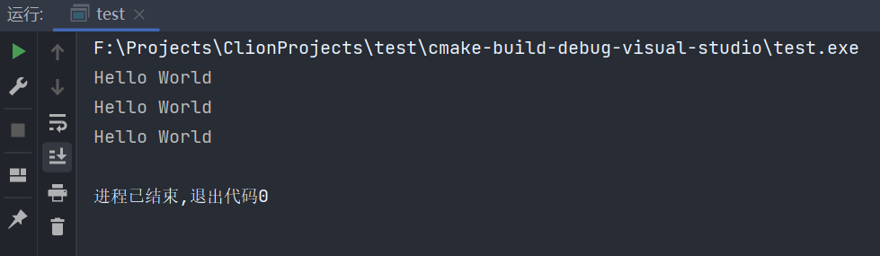
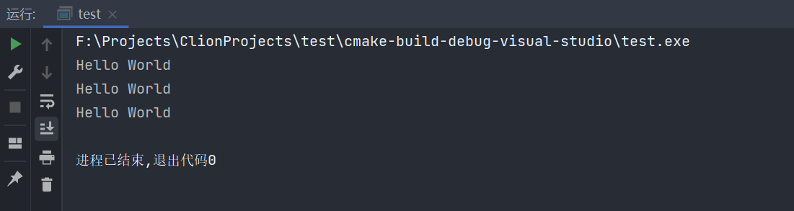
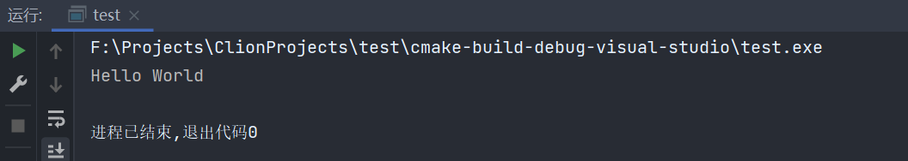
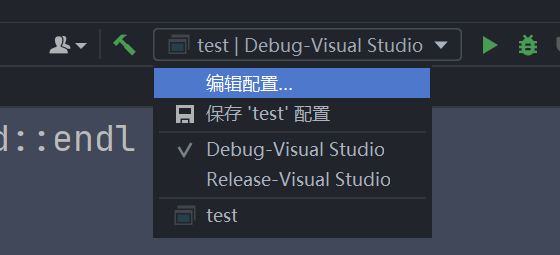
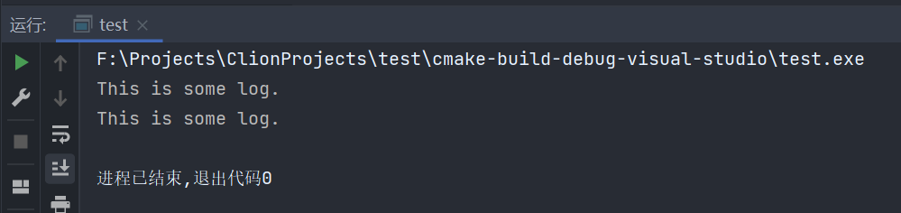
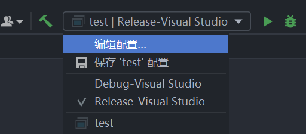
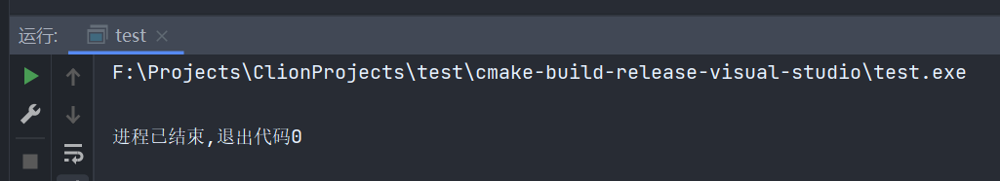
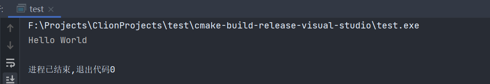

# 055-宏

c++使用预处理器来“宏”化某些操作，避免我们重复输入代码

当我们编译c++代码时，预处理器会过一遍c++你所能看到的语句，预编译器指令符号以#开头，当预编译器处理完代码后，它会把代码给到编译器进行实际的编译，预处理阶段实际上是一个`文本编辑`阶段，在这个阶段，我们可以控制将什么样的代码给到编译器，这就是宏所能做得事情，我们能做的事情就是写一些宏，它可以将代码里面的东西替换为其他内容，基本上就像遍历我们的代码，然后进行查找和替换，但是不仅仅是简单的查找和替换，它可以使用形参、实参、变量等进行高级的查找替换，我们可以自定义调用宏的方式，我们可以自定义调用宏的方式，定义宏是如何展开的。

宏和上一章的模板还是有一定区别的，它们发生的时间不同，模板的评估发生在实际的编译过程中，宏是在预编译时期，它只是比较高级的纯文本替换。

看下面这个例子，我们可以创建一个宏`HELLO`，并让他输出`Hello World`

```c++
#include <iostream>

#define HELLO std::cout << "Hello World" << std::endl

int main() {
    HELLO;
    HELLO;
    HELLO;
    return 0;
}
```



宏不局限于实际的语句，可以是任何东西，像下面这样，定义OPEN CURLY为`{`

```c++
#include <iostream>

#define HELLO std::cout << "Hello World" << std::endl
#define OPEN_CURLY {

int main() OPEN_CURLY
    HELLO;
    HELLO;
    HELLO;
    return 0;
}
```



依然没有什么问题

当然，宏可以携带参数，像下面这样，我们可以写一个log宏，让它为我们输出一些内容

```c++
#include <iostream>

#define LOG(message) std::cout << message << std::endl

int main() {
    LOG("Hello World");
    return 0;
}
```



我们还可以在cmakelist中添加构建类型判断，并在代码中判断是否定义或者定义的值，分别在debug或者release模式下实现不同的log输出效果

```cmake
cmake_minimum_required(VERSION 3.19)
project(test)

set(CMAKE_CXX_STANDARD 14)

add_executable(test main.cpp)

if (CMAKE_BUILD_TYPE MATCHES "Debug")
    add_definitions(-DDEBUG=1)
elseif (CMAKE_BUILD_TYPE MATCHES "Release")
    add_definitions(-DRELEASE=1)
endif ()
```

```c++
#include <iostream>

//判断是否定义了
#ifdef DEBUG
#define LOG(message) std::cout << message << std::endl
#elif defined(RELEASE)
#define LOG(message)
#endif

//判断定义值
#if DEBUG == 1
#define LOGD(message) std::cout << message << std::endl
#elif RELEASE == 1
#define LOGD(message)
#endif

int main() {
    LOG("This is some log.");
    LOGD("This is some log.");
    return 0;
}
```

之后通过切换不同的编译模式，就可以实现不同的输出效果









在宏里面，可以通过`\`来换行，像下面这样

```c++
#include <iostream>

#define MAIN int main() {\
std::cout << "Hello World" << std::endl;\
return 0;\
}

MAIN
```



***

