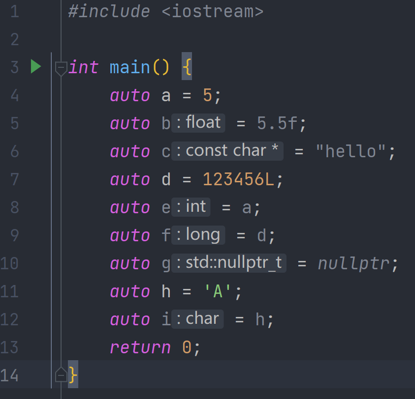

# 056-auto

使用`auto`可以让c++编译器推断类型

```c++
#include <iostream>

int main() {
    auto a = 5;
    auto b = 5.5f;
    auto c = "hello";
    auto d = 123456L;
    auto e = a;
    auto f = d;
    auto g = nullptr;
    auto h = 'A';
    auto i = h;
    return 0;
}
```

像上面这样，在clion中，我们可以看到IDE为我们做出的提示



auto具有两面性，可以在一些适当的地方使用它，以保证代码的整洁，看下面这个例子

```c++
#include <iostream>
#include <vector>

int main() {
    std::vector<std::string> vector;
    vector.emplace_back("aaa");
    vector.emplace_back("bbb");
    vector.emplace_back("ccc");
    vector.emplace_back("ddd");
    //这里我们使用迭代器来进行遍历
    for (std::vector<std::string>::iterator it = vector.begin(); it < vector.end(); it++) {
        std::cout << *it << std::endl;
    }
    return 0;
}
```

可以看到，我们如果使用迭代器来进行vector的遍历，这玩意会非常长，及其难写，这个时候，我们就可以使用auto来进行操作了，可以大大减少代码量，使代码更加整洁，像下面这样

```c++
#include <iostream>
#include <vector>

int main() {
    std::vector<std::string> vector;
    vector.emplace_back("aaa");
    vector.emplace_back("bbb");
    vector.emplace_back("ccc");
    vector.emplace_back("ddd");
    //使用auto来替代std::vector<std::string>::iterator
    for (auto it = vector.begin(); it < vector.end(); it++) {
        std::cout << *it << std::endl;
    }
    return 0;
}
```

我们还可以整一个更长的类型，像下面这样

```c++
#include <iostream>
#include <vector>
#include <unordered_map>

class Device {

};

class DeviceManager {
private:
    /**
     * 这里，我们整一个巨长的类型
     */
    std::unordered_map<std::string, std::vector<Device>> mDeviceMap;
public:
    /**
     * 在这里，你为了返回这个类型，你不得不把这串东西到处复制
     */
    const std::unordered_map<std::string, std::vector<Device>> &getDeviceMap() const {
        return mDeviceMap;
    }
};


int main() {
    DeviceManager deviceManager;
    //我们获取device map
    const std::unordered_map<std::string, std::vector<Device>> &map = deviceManager.getDeviceMap();
    return 0;
}
```

可以看到，我们这里面有一个非常长的map类型，我们想要使用它，就得到处复制

虽然我们可以通过using或者typedef来解决这个问题，像下面这样

```c++
#include <iostream>
#include <vector>
#include <unordered_map>

class Device {

};

using DeviceMap = std::unordered_map<std::string, std::vector<Device>>;
typedef std::unordered_map<std::string, std::vector<Device>> DeviceMap;

class DeviceManager {
private:
    DeviceMap mDeviceMap;
public:
    const DeviceMap &getDeviceMap() const {
        return mDeviceMap;
    }
};


int main() {
    DeviceManager deviceManager;
    //我们获取device map
    const DeviceMap &map = deviceManager.getDeviceMap();
    return 0;
}
```

但是这样还得再多定义一次，这就是使用auto的最佳时刻，像下面这样

```c++
#include <iostream>
#include <vector>
#include <unordered_map>

class Device {

};


class DeviceManager {
private:
    std::unordered_map<std::string, std::vector<Device>> mDeviceMap;
public:
    const auto &getDeviceMap() const {
        return mDeviceMap;
    }
};


int main() {
    DeviceManager deviceManager;
    //我们获取device map 这里如果不写引用，会再复制一次
    const auto &map = deviceManager.getDeviceMap();
    return 0;
}
```

看起来爽多了

使用这种长类型的时候，我们可以使用auto，但是一般的类型，我们还是别用比较好，因为这样会降低代码的可读性

就像在Java10的时候推出了var来做类型推断，但是直到现在，我也没用过

```java
public class Hello {
    public static void main(String[] args) {
        var a = "Hello";
        var length = a.length();
        System.out.println(length);
    }
}
```

我用一下试试