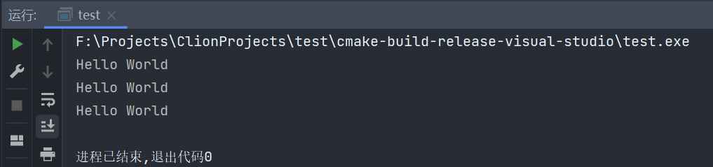
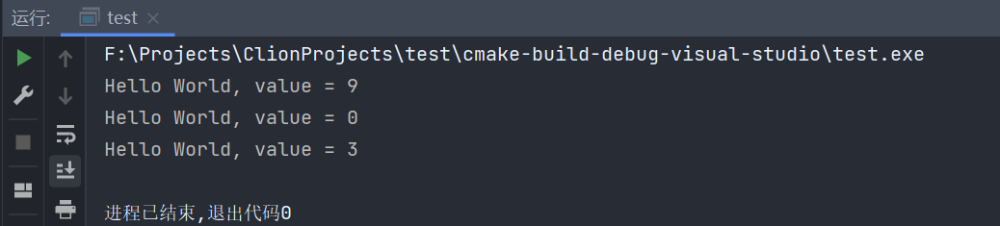

# 058-函数指针

函数指针就是将函数赋值给一个变量的方法

这节的函数指针是继承自c的

Java8中也有这样的操作

```c++
import java.util.function.Function;

public class Hello {
    public static void main(String[] args) {
        Function<Integer, Integer> function = Hello::testFunction;
        int result = function.apply(5);
        System.out.println(result);
    }

    private static int testFunction(int param) {
        return param * 2;
    }
}
```

```c++
#include <iostream>

void hello() {
    std::cout << "Hello World" << std::endl;
}

int main() {
    auto fun = hello;
    fun();
    fun();
    fun();
    return 0;
}
```

我们可以使用auto来让编译器推断类型，并将hello函数赋值给fun变量，并对其进行调用



它的实际类型为`void (*)()`

我们定义函数指针的方式为

`返回类型 (*名称)(一堆参数的类型)`

我们可以使用具体类型来接受或者使用typedef来进行定义并赋值调用

```c++
#include <iostream>

void hello() {
    std::cout << "Hello World" << std::endl;
}

int main() {
    //我们可以通过实际的类型来接收它，而不是auto
    void (*fun)() = hello;
    fun();
    fun();
    fun();
    //也可以使用typedef来定义
    typedef void (*HelloFunction)();
    //创建函数指针
    HelloFunction function = hello;
    function();
    function();
    function();
    return 0;
}
```

我们还可以尝试为函数添加参数，像下面这样

```c++
#include <iostream>

void hello(int value) {
    std::cout << "Hello World, value = " << value << std::endl;
}

int main() {
    void (*fun)(int) = hello;
    fun(9);
    fun(0);
    fun(3);
    return 0;
}
```



在Java中，我们可以这样写

```java
import java.util.Arrays;
import java.util.List;

public class Hello {
    public static void main(String[] args) {
        List<Integer> list = Arrays.asList(9, 9, 0, 9, 0, 3);
        list.forEach(Hello::sout);
    }

    private static void sout(int value) {
        System.out.println(value);
    }
}
```

我们使用函数指针，一样的，可以这样写

```c++
#include <iostream>
#include <vector>

void foreach(const std::vector<int> &vector, void (*fun)(const int &)) {
    for (int obj: vector) {
        fun(obj);
    }
}

void print(const int &value) {
    std::cout << value << std::endl;
}

int main() {
    std::vector<int> vector = {9, 9, 0, 9, 0, 3};
    foreach(vector, print);
    return 0;
}
```

在java中，我们可以使用lambda表达式

```java
import java.util.Arrays;
import java.util.List;

public class Hello {
    public static void main(String[] args) {
        List<Integer> list = Arrays.asList(9, 9, 0, 9, 0, 3);
        list.forEach(value -> System.out.println(value));
    }
}
```

在这里一样的

```c++
#include <iostream>
#include <vector>

void foreach(const std::vector<int> &vector, void (*fun)(const int &)) {
    for (int obj: vector) {
        fun(obj);
    }
}

int main() {
    std::vector<int> vector = {9, 9, 0, 9, 0, 3};
    foreach(vector, [](const int &value) { std::cout << value << std::endl; });
    return 0;
}
```

***

