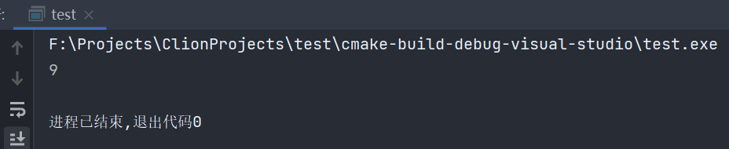

# 059-lambda

lambda实际上就是我们定义的一个匿名函数，这个就像是一个快速的一次性函数，它可以被视为一个变量。

lambda可以让我们不需要函数定义，就可以定义一个函数，它的用法就是在我们会设置函数指针，指向函数的任何地方，我们都可以将它设置为lambda


如何声明

```c++
[捕获](参数类型)mutable(可选) {
    //some code...
};
```

什么是捕获？

捕获可以传递=、&、this、值或者啥也不传

如果你要在lambda表达式中使用外面的值，像下面这样

```c++
int a = 5;
int b = 8;
auto function = []() {
    std::cout << a + b << std::endl;
};
```

是不行的，我们可以通过在[]中添加=使用值传递，&引用传递、a,&b，a使用值传递，b使用引用传递，即可在lambda中使用这个值，像下面这样

```c++
int a = 5;
int b = 8;
auto function = [=]() {
    std::cout << a + b << std::endl;
};
```

这里就使用了值传递，在使用值传递的情况下，想要在里面修改中值，是不行的，我们需要添加mutable，才可以对值进行修改

```c++
#include <iostream>
#include <vector>
#include <functional>

void foreach(const std::vector<int> &vector, const std::function<void(int)> &fun) {
    for (int obj: vector) {
        fun(obj);
    }
}

int main() {
    std::vector<int> vector = {9, 9, 0, 9, 0, 3};
    foreach(vector, [=](const int &value) { std::cout << value << std::endl; });
    return 0;
}
```

如果我们添加了捕获，c类型的函数指针是无法接收这样的lambda的，我们需要使用c++的std::function接收，比c++的函数指针也更加容易理解。

如果我们想要在lambda中调用当前类的某个方法，就需要传递this进去，否则不能调用

```c++
#include <iostream>
#include <functional>

class Test {
private:
    void test() {
        std::cout << "Test function was invoke" << std::endl;
    }

    void runFunction(const std::function<void()> &fun) {
        fun();
    }

public:
    void run() {
        runFunction([this]() {
            test();
        });
    };
};

int main() {
    Test test;
    test.run();
    return 0;
}
```

> 我终于知道这里为啥写个this了 :laughing:
>
> https://cs.android.com/android/platform/superproject/+/master:frameworks/native/services/inputflinger/dispatcher/InputDispatcher.cpp;l=571


一个使用实例是，在algorithm中有个函数叫做find_if，它接受一个迭代区间与一个函数，并返回首个符合条件的值，像下面这样

```c++
#include <iostream>
#include <vector>
#include <functional>
#include <algorithm>

int main() {
    std::vector<int> vector = {9, 9, 0, 9, 0, 3};
    auto result = std::find_if(vector.begin(), vector.end(), [](int value) {
        return value > 0;
    });
    std::cout << *result << std::endl;
    return 0;
}
```



***

