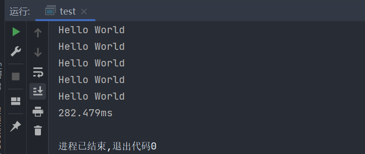
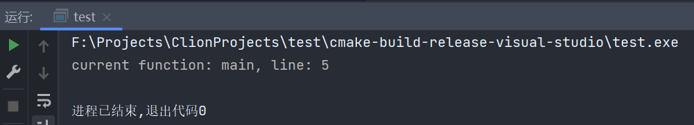
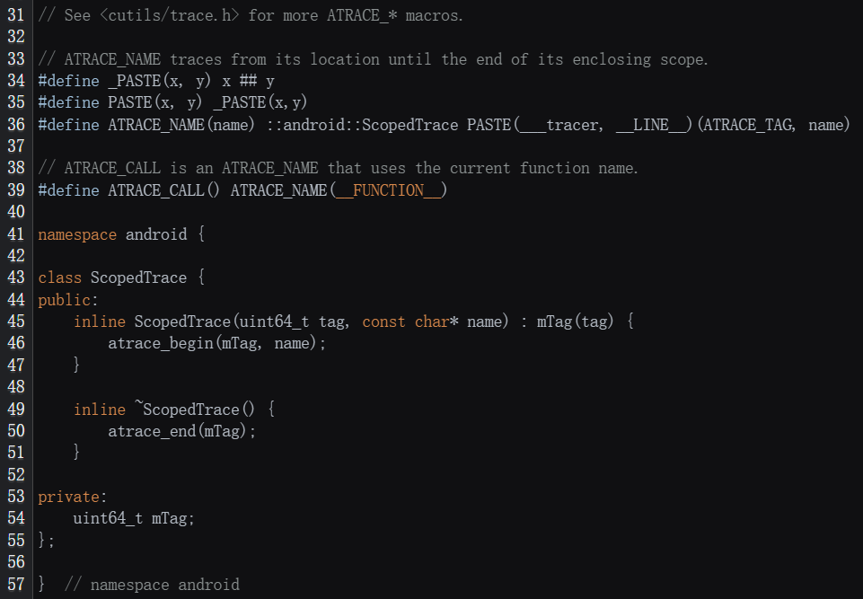

# 063-计时

使用chrone可以实现时间相关的一些操作

下面这个例子展示如何能够计算一行代码的执行时长

```c++
#include <iostream>
#include <thread>
#include <chrono>

int main() {
    //使用这个可以实现计时文字表示比如1min 1s 1ns...
    using namespace std::chrono_literals;
    auto start = std::chrono::high_resolution_clock::now();
    std::this_thread::sleep_for(1s);
    auto end = std::chrono::high_resolution_clock::now();
    std::chrono::duration<float> duration = end - start;
    std::cout << duration.count() << "s" << std::endl;
    return 0;
}
```

我们可以利用栈上对象出了作用域析构来编写计时器，像下面这样

```c++
#include <iostream>
#include <chrono>

class Timer {
private:
    std::chrono::time_point<std::chrono::steady_clock> now;
public:
    Timer() {
        now = std::chrono::high_resolution_clock::now();
    }

    ~Timer() {
        std::chrono::duration<float> duration = std::chrono::high_resolution_clock::now() - now;
        std::cout << duration.count() * 1000 << "ms" << std::endl;
    }
};

void test() {
    Timer timer;
    for (int i = 0; i < 100000; i++) {
        std::cout << "Hello World" << std::endl;
    }
}


int main() {
    test();
    return 0;
}
```



可以看到，在debug模式下，10万次输出用时282.479ms

***

还有一个例子是，在Android中，ScopedTrace就是利用这种方式实现的，而ATRACE_CALL时定义的一个宏，利用\_\_FUNCTION\_\_获取函数名称\_\_LINE\_\_获取当前行号

```c++
#include <iostream>

int main() {
    std::cout << "current function: " << __FUNCTION__ << ", line: " << __LINE__ << std::endl;
    return 0;
}
```



虽然实现的细节不清楚，但是看代码大概可以知道是这种实现方式



可以看到再构造函数中调用atrace_begin，析构函数中调用atrace_end

具体参照

[https://cs.android.com/android/platform/superproject/+/master:system/core/libutils/include/utils/Trace.h;l=39;drc=1036798a87d1c88f0764bd79044b9518b53dc922;bpv=0;bpt=1](https://cs.android.com/android/platform/superproject/+/master:system/core/libutils/include/utils/Trace.h;l=39;drc=1036798a87d1c88f0764bd79044b9518b53dc922;bpv=0;bpt=1)

***


