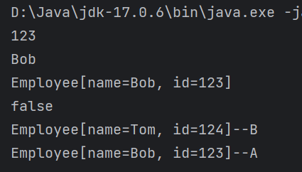
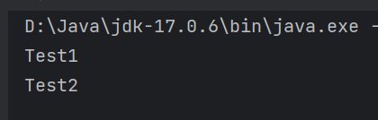

# Java9-17新特性

Java 17 在2021 年9 月14 日正式发布，成为最新的长期支持版本，从Java8往后，Java9~Java17中又新增了大量好用的特性，虽然我们不太能用的上，但是，我们应该去了解一下我们平时打交道最多的Java语言，这些年都在偷偷干些什么。

> 注1：该文档会为每个新特性来编写示例代码，这些示例代码可以通过上方的包名来找到他的存放位置，我就不再说这个示例代码位于哪个包下面，这太啰嗦了。
>
> 注2：实际上，我这里描述的新特性只是一些语言特性，除此之外，还有很多非语言特性与API的更新，这里我就不再描述，大家感兴趣可以在网上查找相关资料。


### Java9

#### 接口的private方法

随着static与default在接口中的引入，我们可以在接口中来为某些方法编写默认的实现，不过这很明显有一些问题，如果我们想要为某个方法编写的默认代码非常多，我们期望将其逻辑拆分为多个方法，我们就只可以来编写更多的default方法，这些方法都是public的，但是我们的这些逻辑很明显不需要被外部调用，所以在Java9中引入了接口的private方法，示例如下

```java
package com.lln.java9.test1;

public interface OldInterface {
    default void test() {
        System.out.println("test()...");
    }

    static void test1() {
        System.out.println("test1()...");
    }

    default void method() {
        // 这里调用test()与test1()来实现我们期望的逻辑默认逻辑
        test();
        test1();
    }
}
```

```java
package com.lln.java9.test1;

public interface NewInterface {
    private void test() {
        System.out.println("test()...");
    }

    private static void test1() {
        System.out.println("test1()...");
    }

    default void method() {
        test();
        test1();
    }
}
```

```java
package com.lln.java9.test1;

public class Main {
    public static void main(String[] args) {
        OldInterface oldInterface = new OldInterface() {
            // 空实现
        };
        oldInterface.method();
        // 可以
        oldInterface.test();
        // 这样也行
        OldInterface.test1();
        // 我不想让外部调用啊，咋办？

        // Java9中引入接口的private方法
        NewInterface newInterface = new NewInterface() {
            // 空实现
        };
        newInterface.method();
        // 不行了，接口内限制了private，不可调用
        // newInterface.test();
        // NewInterface.test1();
    }
}
```


#### try-with-resources的改进

由于使用try-with-resources的时候，我们必须将资源定义在资源头内，也就是try的括号里面，但是这样看起来有点笨拙，所以在Java9中支持了将资源提前声明，并直接在资源头内写上资源的名称即可，不过需要注意，这个资源必须是final类型或者说是实际上的final类型（也就是你可以不写final，但是你不能改它）

不过这样有个新的坑，因为我们没有在资源头内声明它，所以这个会又再扔出来一个异常，反而又是一个麻烦。

```java
package com.lln.java9.test2;

import java.io.File;
import java.io.FileInputStream;
import java.io.IOException;

public class Main {
    public static void main(String[] args) throws IOException {
        // 这是最传统的读取文件的代码，一堆try catch样板代码
        FileInputStream fileInputStream = null;
        try {
            fileInputStream = new FileInputStream(new File("MyFilePath"));
            // 读取文件
            int read = fileInputStream.read();
        } catch (IOException e) {
            // 处理异常
        } finally {
            if (fileInputStream != null) {
                try {
                    fileInputStream.close();
                } catch (IOException e) {
                    // 再次处理异常
                }
            }
        }

        // 幸好在Java7中引入了try-with-resources，能够自动关闭实现了AutoCloseable接口的流，所以上面的代码可以被修改为
        try (FileInputStream fileInputStream2 = new FileInputStream(new File("MyFilePath"))) {
            int read = fileInputStream2.read();
            // 读取文件
        } catch (IOException e) {
            // 处理异常
        }

        // 由于在资源内我们可以放进去多个需要关闭的资源，写多个可能看起来不得劲，所以在Java9中增加了在try之前定义这些资源的能力
        // 这个资源必须是实际上的final类型
        FileInputStream fileInputStream3 = new FileInputStream(new File("MyFilePath"));
        final FileInputStream fileInputStream4 = new FileInputStream(new File("MyFilePath"));
        FileInputStream fileInputStream5 = new FileInputStream(new File("MyFilePath"));
        // 这不行，这改了变量了，不是final了
        // fileInputStream5 = new FileInputStream("MyFilePath");
        try (fileInputStream3; fileInputStream4; fileInputStream5) {
            int read = fileInputStream3.read();
            // 读取文件
        } catch (IOException e) {
            // 处理异常
        }
    }
}
```

### Java10

#### 局部变量类型推断

在局部定义中（即方法内部），编译器可以自动发现类型，在Java中，使用var关键字来启用这个功能，这个和C++中的auto有点类似。

示例如下

```java
package com.lln.java10.test1;

import java.util.List;

public class Main {
    String field1 = "hello";

    // 这样不行 因为字段上不支持
    // var field2 = "Hello";

    void test() {
        // 声明类型
        String str = "Hello";
        // 让编译器推断
        var str1 = "Hello";
        // 同时支持用户自定义的类型
        Main test = new Main();
        var test1 = new Main();
    }

    /**
     * 静态方法内也是可以的
     */
    static void test1() {
        // 声明类型
        String str = "Hello";
        // 让编译器推断
        var str1 = "Hello";
        // 同时支持用户自定义的类型
        Main test = new Main();
        var test1 = new Main();
    }


    // 方法参数也不可
    /*void test2(var param) {

    }*/

    // 返回值也不可
    /*var test3() {
    }*/

    void test4() {
        // 没初始化数据不行
        // var str;
        // 给个null也不行
        // var str1 = null;
    }

    void test5() {
        List<String> list = List.of("a", "b", "c", "d", "e", "f",
                "g", "h", "i", "j", "k");
        // 这个东西在foreach上非常好使
        for (var str : list) {
            System.out.println(str);
        }
    }
}
```

### Java11

#### Lambda 局部变量推断

在Java10中支持了var，在11中进行了改进，支持在lambda上执行局部变量推断，示例如下

> 这个特性貌似没啥用，还不如不写，写了反正也看不出来是啥类型...

```
package com.lln.java11.test1;

import java.util.Map;

public class Main {
    public static void main(String[] args) {
        Map<Integer, String> map = Map.of(1, "111", 2, "222", 3, "333");
        // 支持为参数添加类型，但是这个要写就都得写var，要不写就都别写
        map.forEach((var integer, var s) -> System.out.println(integer + "--" + s));
        // 这样不行，s没写，报错
        // map.forEach((var integer, s) -> System.out.println(integer + "--" + s));
        // 这也不行，混合也不行
        // map.forEach((var integer, String s) -> System.out.println(integer + "--" + s));
    }
}
```

### Java14

#### switch中的箭头语法

以往我们都是switch+break，在Java14中支持了switch的箭头语法，写起来更容易也更合理，示例如下

```java
package com.lln.java14.test1;

import java.util.Scanner;

public class Main {
    public static void main(String[] args) {
        int num = new Scanner(System.in).nextInt();
        // 这是以前的switch
        switch (num) {
            case 0:
                System.out.println("zero");
                break;
            case 1:
                System.out.println("one");
                break;
            case 2:
                System.out.println("two");
                break;
            default:
                System.out.println("other " + num);
                break;
        }
        // 这是增强的switch
        switch (num) {
            case 0 -> {
                // 多行语句使用{}包裹
                System.out.println("zero");
                System.out.println("zero");
            }
            case 1 -> System.out.println("one");
            case 2 -> System.out.println("two");
            default -> System.out.println("other " + num);
        }
    }
}
```

#### switch作为表达式

通过使用yield，可以为switch表达式返回一个值，如果就一行语句，那么yield可以省略，示例如下

```java
package com.lln.java14.test2;

import java.util.Scanner;

public class Main {
    public static void main(String[] args) {
        int num = new Scanner(System.in).nextInt();
        var result = switch (num) {
            case 0 -> {
                System.out.println("zero");
                yield "zero";
            }
            // 如果只有一行，就不需要yield
            case 1 -> "one";
            case 2 -> "two";
            default -> "other " + num;
        };
        System.out.println(result);
    }
}
```

### Java15

#### 文本块

在Java15中正式支持了文本块，这个特性还是非常好使的，能够让我们的字符串更加清晰的展示出来。同时添加了formatted便于更好的格式化一些信息。

```java
package com.lln.java15.test1;

public class Main {
    public static void main(String[] args) {
        String oldStr = "假如生活欺骗了你，\n" +
                        "不要悲伤，不要心急！\n" +
                        "忧郁的日子里须要镇静：\n" +
                        "相信吧，快乐的日子将会来临！\n" +
                        "心儿永远向往着未来；\n" +
                        "现在却常是忧郁。\n" +
                        "一切都是瞬息，一切都将会过去；\n" +
                        "而那过去了的，就会成为亲切的怀恋。\n";
        System.out.println(oldStr);

        // 使用了文本块的字符串
        String newStr = """
                假如生活欺骗了你，
                不要悲伤，不要心急！
                忧郁的日子里须要镇静：
                相信吧，快乐的日子将会来临！
                心儿永远向往着未来
                现在却常是忧郁。
                一切都是瞬息，一切都将会过去；
                而那过去了的，就会成为亲切的怀恋。
                """;
        System.out.println(newStr);

        // 为了更好的支持文本块，字符串添加了一个方法formatted，可以更好的格式化一些信息
        LocationMessage locationMessage = new LocationMessage("北京", 15.2f);
        System.out.println(locationMessage);
    }

    private static class LocationMessage {
        private final String location;
        private final float temperature;

        public LocationMessage(String location, float temperature) {
            this.location = location;
            this.temperature = temperature;
        }

        @Override
        public String toString() {
            return """
                    location=%s
                    temperature=%.2f
                    """.formatted(location, temperature);

        }
    }
}
```

### Java16

#### 智能转型(instance of模式匹配)

这个特性还是非常好用的，在instanceOf之后，我们不再需要进行类型转换，而是可以直接使用该对象作为instanceOf的类型操作。

例如

```java
package com.lln.java16.test1;

public class Main {
    public static void main(String[] args) {
        test(new Test1());
        test(new Test2());
        test(new Test3());

    }

    private static class Test1 {
        void test1() {
            System.out.println("test1");
        }
    }

    private static class Test2 {
        void test2() {
            System.out.println("test2");
        }
    }

    private static class Test3 {
        void test3() {
            System.out.println("test3");
        }
    }

    private static void test(Object o) {
        // 传统方法
        if (o instanceof Test1) {
            ((Test1) o).test1();
        } else if (o instanceof Test2) {
            ((Test2) o).test2();
        } else if (o instanceof Test3) {
            ((Test3) o).test3();
        }
        // 智能转型
        if (o instanceof Test1 test1) {
            test1.test1();
        } else if (o instanceof Test2 test2) {
            test2.test2();
        } else if (o instanceof Test3 test3) {
            test3.test3();
        }
    }
}
```

#### record

record定义的是希望成为数据传输对象的类，类似JavaBean，当使用了record关键字时，编译器会自动生成：

- 不可变的字段
- 一个规范的构造器
- 每个元素的访问器方法
- equals()
- hashCode()
- toString()

例如

```java
package com.lln.java16.test2;

public record Employee(String name, int id) {
}
```

```java
package com.lln.java16.test2;

import java.util.Map;

public class Main {
    public static void main(String[] args) {
        Employee employee = new Employee("Bob", 123);
        Employee employee1 = new Employee("Tom", 124);
        // id的访问器
        System.out.println(employee.id());
        // name的访问器
        System.out.println(employee.name());
        // toString方法
        System.out.println(employee);
        // equals
        System.out.println(employee.equals(employee1));
        // hashCode
        var result = Map.of(employee, "A", employee1, "B");
        result.forEach((e, s) -> System.out.println(e + "--" + s));
    }
}
```

运行结果



record内可以创建方法，不过这些方法不可以修改字段，只可以读取字段，因为字段实际上是隐式的final类型，例如

```java
package com.lln.java16.test3;

public record Test(int a, int b) {
    void test1() {
        // 创建方法，只可以读取字段
        System.out.println(a);
        System.out.println(b);
    }

    void test2() {
        // 这样是非法的，因为字段不可以修改，隐式的final
        // a = 5;
        // b = 6;
    }
}
```

注意，record也是final的，我们不可以继承它，但是record可以实现接口，例如

```java
package com.lln.java16.test4;

public interface TestInterface {
    int test();

    void test1();

    void test2();
}
```

```java
package com.lln.java16.test4;

public record TestRecord(int test) implements TestInterface {

    // 我们这里实际上没有写test方法的实现，但是我们有一个test的字段，这个字段的访问器实现了test方法
    @Override
    public void test1() {
    }

    @Override
    public void test2() {

    }
}
```

record也支持嵌套和局部类型，例如

```java
package com.lln.java16.test5;

public class Main {
    record Test(String s) {

    }

    public void test() {
        record Test1(String s) {

        }
    }
}
```

嵌套和局部类型的record均为static的

虽然record规范的构造器可以根据record的参数自动创建，但是我们也可以创建一个紧凑的构造器，例如

```java
package com.lln.java16.test6;

public record Test(int x) {
    public Test {
        // 这里虽然看起来在修改x的值，但是但是编译器会为x创建一个中间占位符，并在构造器的最后执行一次赋值，并将结果赋值给this.x
        x += 10;
    }

    public static void main(String[] args) {
        Test test = new Test(5);
        System.out.println(test.x());
    }
}
```

我们也可以重写record的规范构造器，例如

在构造器内，我们必须初始化所有字段，否则会报错

```java
package com.lln.java16.test7;

public record Test(int x) {

    public Test(int x) {
        // 这里必须初始化，否则会报错
        this.x = x;
    }
}
```

### Java17

#### 密封类和密封接口

密封(sealed)类和密封接口可以限制本身能派生处哪些类，例如

```java
package com.lln.java17.test1;

public sealed class Base permits Test1, Test2 {
}
```

```java
package com.lln.java17.test1;

public final class Test1 extends Base{
}

```

```java
package com.lln.java17.test1;

public final class Test2 extends Base {
}

```

我们可以通过sealed密封一个类，通过permits指定一个类支持哪些类可以继承本身，但是如果子类和父类在同一个文件内，则不需要permits，例如

```java
package com.lln.java17.test2;

public sealed class Base {

}

final class Test extends Base {

}

final class Test2 extends Base {

}
```

sealed类的子类只可以通过下面的某个修饰符来定义

- final 不允许有进一步的子类
- sealed 允许有一组密封子类
- non-sealed 允许未知的子类来继承它

例如

```java
package com.lln.java17.test3;

public sealed class Base permits Test1 {
}

```

```java
package com.lln.java17.test3;

public sealed class Test1 extends Base permits Test2, Test3 {
}
```

```java
package com.lln.java17.test3;

public final class Test2 extends Test1 {
}
```

```java
package com.lln.java17.test3;

// 使用non-sealed放开限制
public non-sealed class Test3 extends Test1 {
}

```

```java
package com.lln.java17.test3;

public class Test4 extends Test3 {
}
```

```java
package com.lln.java17.test3;

public class Main {
    public static void main(String[] args) {
        Base test1 = new Test1();
        Base test2 = new Test2();
        Base test3 = new Test3();
        Base test4 = new Test4();
    }
}
```

record也可以用于接口的密封实现，因为record是隐含的final类型，所以不需要再加final了，例如

```java
package com.lln.java17.test4;

public sealed interface TestInterface permits Test {
}
```

```java
package com.lln.java17.test4;

public record Test() implements TestInterface {
}
```

在运行时，我们可以用getPermittedSubclasses方法来获取允许的子类

例如

```java
package com.lln.java17.test5;

public class Main {

    public sealed static class Test {

    }

    public static final class Test1 extends Test {

    }

    public static final class Test2 extends Test {

    }

    public static void main(String[] args) {
        Class<?>[] permittedSubclasses = Test.class.getPermittedSubclasses();
        for (var c : permittedSubclasses) {
            System.out.println(c.getSimpleName());
        }
    }
}
```

运行结果




