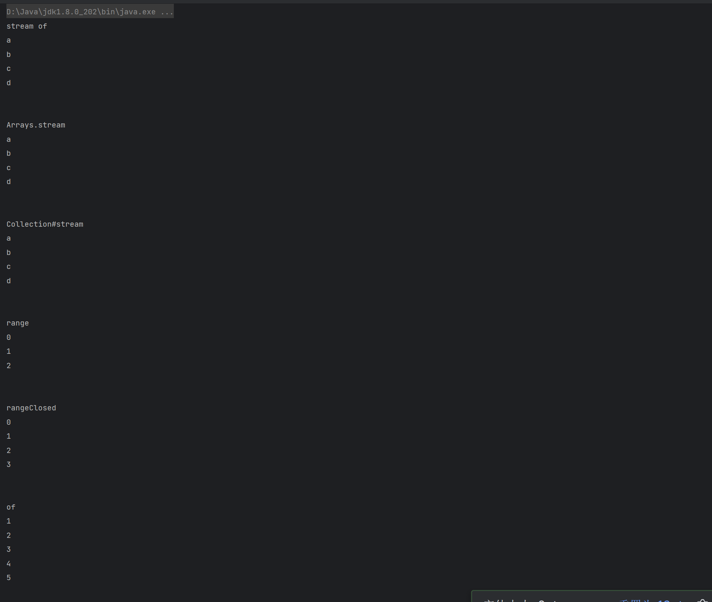

# Java8特性

2014年3月18日，Oracle公司发布Java SE 8，至今已经过去了8年，但是Java8发布的时候添加的一些特性，我们还是有很多人没有用上，这里对Java8添加的特性进行一些分享，让更多人能用起来:happy:，后续可能为大家分享一些Java新版本的一些特性！

Java8中添加了很多新的特性，这次主要分享Lambda表达式与函数式编程、流。

### Lambda表达式与函数式编程

#### 基本介绍

我们为View添加按键监听的时候，需要传递给View一个OnClickListener接口的实现，最传统的写法就是写一个类，对OnClickListener接口进行实现，然后将类的对象new出来，传递过去，例如test1包下的代码。

```java
package com.lln.java8.functional.test1;

import com.lln.java8.widget.View;

public class Main {
    public static void main(String[] args) {
        View view = new View();
        view.setOnClickListener(new MyOnClickListener());
        view.click();
    }
}
```

```java
package com.lln.java8.functional.test1;

import com.lln.java8.widget.View;

public class MyOnClickListener implements View.OnClickListener {
    @Override
    public void onClick(View view) {
        System.out.println("我被点了~");
    }
}
```

当然我们还可以用匿名内部类来实现此操作，例如test2包下的代码。

```java
package com.lln.java8.functional.test2;

import com.lln.java8.widget.View;

public class Main {
    public static void main(String[] args) {
        View view = new View();
        view.setOnClickListener(new View.OnClickListener() {
            @Override
            public void onClick(View view) {
                System.out.println("我被点了");
            }
        });
        view.click();
    }
}
```

我们会发现，每次都需要声明并且new这个类，即使使用了匿名内部类，操作还是非常冗余，其实我们实际上只会关心三个东西

- 方法的参数列表
- 方法中的核心操作代码
- 方法的返回类型

只需要这三个，我们其实就可以告诉view，你被点击后，应该有怎样的反应，也就是给一个参数、进行一些操作、给出指定结果，也就是一个函数，所以我们可以将view被点击执行的内容，抽象为一个函数，在Java中，这个抽象可以使用lambda表达式实现，我们将函数传递给OnClickListener，它在点击后会执行这个函数，可以认为这个就是函数使编程，Java中使用Lamdba表达式来实现函数式编程。

函数式编程是一种编程范式，是编程风格。

一个函数实际上应该是一定有返回值的，但是Java中存在Void，所以允许一个函数没有返回值。

我们使用lambda表达式来对上面的操作进行改造，见test3包。

```java
package com.lln.java8.functional.test3;

import com.lln.java8.widget.View;

public class Main {
    public static void main(String[] args) {
        View view = new View();
        View.OnClickListener onClickListener = v -> System.out.println("我被点击了");
        view.setOnClickListener(onClickListener);
        view.click();

        View view2 = new View();
        view2.setOnClickListener(v -> System.out.println("我被点击了"));
        view2.click();
    }
}
```

可以看到，创建了一个名为onClickListener的函数，并将其传递给了view，这样view被点击后，就会执行这个函数，实现对应的效果，当然，还可以创建匿名函数直接传递。

可以看到，lambda表达式表达的是一个函数，但是它需要寄托于接口，所以lambda表达式在Java中其实就是对接口的实现，但是任何接口都能用lambda表达式实现吗？那必然不行，只有接口中**有且仅有一个抽象方法**的时候，这个接口才可以使用lambda表达式进行实现。

Java中规定，有且只有一个抽象方法的接口，是**函数式接口**，该接口中，也允许有其他的默认方法和静态方法。函数式接口上可以添加注解@FunctionalInterface，例如

```java
@FunctionalInterface
public interface OnClickListener {
    void onClick(View view);
}
```

这个注解可以在编译时期为我们做检查，如果你的接口不是函数式接口，编译就会报错，作用和@override类似，写了就会检查，不写就不会检查，也没啥影响。

下面我们看看这个lambda表达式的具体使用方法

lambda表达式最基本的格式为

```java
()->{}
```

- () 表示参数列表

- -> 后面跟的是函数主体

- {} 函数主体，表达式的返回值，由这个函数主体中代码来决定

一个lambda表达式如何编写，实际上就是看它想要表达的函数式接口是如何定义的？

看test4包下的代码

```java
package com.lln.java8.functional.test4;

@FunctionalInterface
public interface Action {
    void run();
}
```

我们有一个名为Action的函数式接口，里面有一个无参无返回值的抽象方法

```java
package com.lln.java8.functional.test4;

public class Main {
    public static void main(String[] args) {
        /*Action action1 = new Action() {
            @Override
            public void run() {

            }
        };*/
        //如果是空实现，就这样写，没有任何内容，但是基本格式必须要有()->{}
        Action action1 = () -> {
        };

        /*Action action2 = new Action() {
            @Override
            public void run() {
                System.out.println("Hello World");
            }
        }*/
        //如果只有一行语句，那么大括号可以省略~
        Action action2 = () -> System.out.println("Hello World");


        /*Action action3 = new Action() {
            @Override
            public void run() {
                System.out.println("Hello World");
                System.out.println("Hello World");
                System.out.println("Hello World");
            }
        };*/
        //但是如果有多行语句，大括号务必写上，因为需要告诉编译器，这个lambda表达式到哪结束
        Action action3 = () -> {
            System.out.println("Hello World");
            System.out.println("Hello World");
            System.out.println("Hello World");
        };
    }
}
```

看上面的代码，基本就可以理解，这里不过多描述

对于有参数，无返回值的呢？看test5包下的内容

```java
package com.lln.java8.functional.test5;

public class Main {
    public static void main(String[] args) {
        /*Action1 action1 = new Action1() {
            @Override
            public void run(int a) {
                System.out.println(a);
            }
        };*/
        //这是完整的写法
        Action1 action1 = (int a) -> {
            System.out.println(a);
        };
        //参数类型其实可以直接去掉，因为Action1接口中
        //只有一个抽象方法，jvm会自动推断他是什么类型
        Action1 action2 = (a) -> {
            System.out.println(a);
        };
        //当只有一个参数的时候，可以直接去掉小括号
        Action1 action3 = a -> {
            System.out.println(a);
        };
        //因为就只有一行语句，花括号也可以去掉
        Action1 action4 = a -> System.out.println(a);

        //需要注意，如果有两个参数，小括号就不能省略了~
        Action2 action5 = (a, b) -> {
            System.out.println(a);
            System.out.println(b);
        };
    }
}
```

如果是有参数又有返回值的呢？见test6包下的内容

```java
package com.lln.java8.functional.test6;

public class Main {
    public static void main(String[] args) {
        /*Action action = new Action() {
            @Override
            public int run(int a, int b) {
                return a + b;
            }
        };*/

        //和写普通方法其实没什么区别，直接写return即可
        Action action1 = (a, b) -> {
            return a + b;
        };
        //但是如果方法中只有一个语句，可以直接省略return
        //刚刚还提到，如果只有一行语句，花括号也可以省略
        Action action2 = ((a, b) -> a + b);
        //多行语句则必须写return
        Action action3 = (a, b) -> {
            System.out.println(a);
            System.out.println(b);
            return a + b;
        };

    }
}
```

#### 类型推断

如果两个方法分别接受两种不同的函数式接口，不过他们的表达方法相同，调用的时候，jvm会自动推断你写的lambda表达式表达的是什么类型，见test7包下的内容

```java
package com.lln.java8.functional.test7;

public class Main {
    public static void main(String[] args) {
        //这个会被推断为Test1的实现
        test1(() -> {
        });
        //就会被推断为Test2的实现
        test2(() -> {
        });
    }

    private static void test1(Test1 test1) {

    }

    private static void test2(Test2 test2) {

    }
}

interface Test1 {
    void test();
}

interface Test2 {
    void test();
}
```

#### 重载解析

我们知道，Java中支持方法重载，即相同的方法可以有不同的参数，test8包下的情况

```java
package com.lln.java8.functional.test8;

public class Main {
    public static void main(String[] args) {
        test(() -> {
        });
    }

    private static void test(Test1 test1) {

    }

    private static void test(Test2 test2) {

    }
}

interface Test1 {
    void test();
}

interface Test2 {
    void test();
}
```

因为都是我们两个接口在lambda表达式下的表达方式相同，jvm已经不知道你想调用哪个了，最好是别这么定义，当然，我们可以进行强制类型转换，来解决这个冲突，像下面这样

```java
test((Test1) () -> {
});
test((Test2) () -> {
});
```

#### 类库函数接口

以上这些函数式接口都是我们自己定义的，实际上，Java在类库中已经为我们准备好了一套通用的函数式接口，因为是通用的，所以对每个类都进行了泛型化，便于我们提供自己类型，以满足自己的需求

在Java中，一个函数有四种情况，

- 有参有返回值
- 有参无返回值
- 无参有返回值
- 无参无返回值

所以在Java中提供的接口可以分为这四种

- 有参有返回值        Function<T, R>    函数
- 有参无返回值        Consumer<T>    消费者
- 无参有返回值        Supplier<T>    生产者
- 无参无返回值        Runnable    可运行

这里再介绍一个略微特殊的类型，为任意类型参数，返回值为boolean，这函数式接口为Predicate<T>，它接受一个任意类型，返回boolean类型，称为断言。

针对有参数的类型，如果你的参数有两个，设计者也想到了，有BiConsumer<T, U>、BiFunction<T, U, R>、BiPredicate<T, U>供你使用

因为是泛型接口，所以我们的基本数据类型无法使用了，只能使用它的包装类型，使用包装类型会导致频繁开箱装箱，耗费性能，这点设计者也想到了，所以对这些函数式接口进行了特化，都在function包下，如下


下面详细介绍一下这些接口，并简单使用一下

##### Predicate  

test9包下的内容

首先看一下定义

```java
@FunctionalInterface
public interface Predicate<T> {

    /**
     * Evaluates this predicate on the given argument.
     *
     * @param t the input argument
     * @return {@code true} if the input argument matches the predicate,
     * otherwise {@code false}
     */
    boolean test(T t);
}
```

抽象方法为test，初次之外，还提供了一些其他实现，例如将两个断言以and或者or的方式连接，或者是对一个断言取反


下面是一个示例

```java
package com.lln.java8.functional.test9;

import java.util.ArrayList;
import java.util.Arrays;
import java.util.List;
import java.util.function.Predicate;

public class Main {
    public static void main(String[] args) {
        //测试list里面的每个数字是否都大于5
        List<Integer> list = new ArrayList<>(Arrays.asList(1, 2, 3, 4, 5, 6, 7, 8));
        Predicate<Integer> predicate = number -> number > 5;
        //测试list里面每个数字是不是都大于5
        System.out.println(test(list, predicate));
        //测试list里面每个数字是不是都小于等于5
        Predicate<Integer> negate = predicate.negate();
        System.out.println(test(list, negate));
        //测试list里面的每个数字是不是都既大于5 又小于等于5，明显不可能，只是个例子
        Predicate<Integer> and = predicate.and(negate);
        System.out.println(test(list, and));
        //测试list里面的每个数字是不是都大于5或者小于等于5
        Predicate<Integer> or = predicate.or(negate);
        System.out.println(test(list, or));

        //还有一个例子，在Collection集合中，有一个方法，default boolean removeIf(Predicate<? super E> filter)
        //可以移除满足条件的值，例如，移除大于5的值
        list.removeIf(predicate);
        System.out.println(list);

    }

    private static <T> boolean test(List<T> list, Predicate<T> predicate) {
        for (T t : list) {
            if (!predicate.test(t)) {
                return false;
            }
        }
        return true;
    }
}
```

> removeIf的实现
>
> 

##### Consumer

test10包下的内容

先看一下Consumer的定义

```java
@FunctionalInterface
public interface Consumer<T> {

    /**
     * Performs this operation on the given argument.
     *
     * @param t the input argument
     */
    void accept(T t);
}
```

抽象方法为accept，初次之外还有一个默认的方法，可以将两个Consumer进行连接，让他干完这件事接着去干下一件


下面是两个示例

```java
package com.lln.java8.functional.test10;

import java.util.function.Consumer;

public class Main {
    public static void main(String[] args) {
        Test test = new Test("Hello");
        //对str进行反转
        Consumer<Test> consumer1 = t -> {
            StringBuilder stringBuilder = new StringBuilder(test.str);
            test.str = stringBuilder.reverse().toString();
        };
        //对str进行大写
        Consumer<Test> consumer2 = t -> t.str = t.str.toUpperCase();

        //对str先进行反转，然后再全大写
        Consumer<Test> consumer3 = consumer1.andThen(consumer2);

        consumer1.accept(test);
        System.out.println(test.str);


        test.str = "Hello";
        consumer2.accept(test);
        System.out.println(test.str);


        test.str = "Hello";
        consumer3.accept(test);
        System.out.println(test.str);

    }


    private static class Test {
        String str;

        public Test(String str) {
            this.str = str;
        }
    }
}
```

> 运行结果：
>
> olleH
> HELLO
> OLLEH

```java
package com.lln.java8.functional.test10;

import java.util.Arrays;
import java.util.List;

public class Main2 {
    public static void main(String[] args) {
        //在Java8中为Iterable接口中添加了一个默认方法，forEach，通过接受一个Consumer来及进行遍历
        List<String> students = Arrays.asList("ZhangSan", "LiSi", "WangWu");
        students.forEach(s -> System.out.println(s));
    }
}
```

> 运行结果：
>
> ZhangSan
> LiSi
> WangWu

> forEach的实现
> 

##### Function

test11包下的内容

先看一下定义

```java
package java.util.function;

import java.util.Objects;

/**
 * Represents a function that accepts one argument and produces a result.
 *
 * <p>This is a <a href="package-summary.html">functional interface</a>
 * whose functional method is {@link #apply(Object)}.
 *
 * @param <T> the type of the input to the function
 * @param <R> the type of the result of the function
 *
 * @since 1.8
 */
@FunctionalInterface
public interface Function<T, R> {

    /**
     * Applies this function to the given argument.
     *
     * @param t the function argument
     * @return the function result
     */
    R apply(T t);

    /**
     * Returns a composed function that first applies the {@code before}
     * function to its input, and then applies this function to the result.
     * If evaluation of either function throws an exception, it is relayed to
     * the caller of the composed function.
     *
     * @param <V> the type of input to the {@code before} function, and to the
     *           composed function
     * @param before the function to apply before this function is applied
     * @return a composed function that first applies the {@code before}
     * function and then applies this function
     * @throws NullPointerException if before is null
     *
     * @see #andThen(Function)
     */
    default <V> Function<V, R> compose(Function<? super V, ? extends T> before) {
        Objects.requireNonNull(before);
        return (V v) -> apply(before.apply(v));
    }

    /**
     * Returns a composed function that first applies this function to
     * its input, and then applies the {@code after} function to the result.
     * If evaluation of either function throws an exception, it is relayed to
     * the caller of the composed function.
     *
     * @param <V> the type of output of the {@code after} function, and of the
     *           composed function
     * @param after the function to apply after this function is applied
     * @return a composed function that first applies this function and then
     * applies the {@code after} function
     * @throws NullPointerException if after is null
     *
     * @see #compose(Function)
     */
    default <V> Function<T, V> andThen(Function<? super R, ? extends V> after) {
        Objects.requireNonNull(after);
        return (T t) -> after.apply(apply(t));
    }

    /**
     * Returns a function that always returns its input argument.
     *
     * @param <T> the type of the input and output objects to the function
     * @return a function that always returns its input argument
     */
    static <T> Function<T, T> identity() {
        return t -> t;
    }
}
```

抽象方法为apply 除此之外，还存在两个方法，用来连接两个函数


下面是一个示例
```java
package com.lln.java8.functional.test11;

import java.util.Collections;
import java.util.HashSet;
import java.util.Set;
import java.util.function.Function;

public class Main {
    public static void main(String[] args) {
        String str = "a-b-c-d-e-f-g-a-b-c";
        // 定义第一个方法，可以将字符串通过-分割，并返回一个数组
        Function<String, String[]> function1 = s -> s.split("-");
        // 定义第二个方法，可以将一个字符串数组转换为一个list
        Function<String[], Set<String>> function2 = arr -> {
            HashSet<String> set = new HashSet<>();
            Collections.addAll(set, arr);
            return set;
        };
        // 第三个方法是通过第一个和第二个组合而成的，使用了andThen方法
        Function<String, Set<String>> function3 = function1.andThen(function2);
        // compose类似

        // 调用第三个方法
        Set<String> result = function3.apply(str);
        result.forEach(s -> System.out.println(s));
    }
}
```

>运行结果：
>
>a
>b
>c
>d
>e
>f
>g

在jdk1.8中map中新增了方法computeIfAbsent，可以给定一个key和一个函数，如果key不存在，则使用函数生成一个value，并将key和value添加到map中，如下
```java
package com.lln.java8.functional.test11;

import java.util.HashMap;
import java.util.Map;

public class Main2 {
    public static void main(String[] args) {
        Map<String, String> map = new HashMap<>();
        map.put("1", "111");
        map.put("2", "222");
        map.computeIfAbsent("3", s -> s + s + s);
        map.forEach((s, s2) -> {
            System.out.println(s + "---" + s2);
        });
    }
}

```
运行结果
>1---111
>2---222
>3---333

##### Supplier

test12包下的内容

先看其定义

```java

package java.util.function;

/**
 * Represents a supplier of results.
 *
 * <p>There is no requirement that a new or distinct result be returned each
 * time the supplier is invoked.
 *
 * <p>This is a <a href="package-summary.html">functional interface</a>
 * whose functional method is {@link #get()}.
 *
 * @param <T> the type of results supplied by this supplier
 *
 * @since 1.8
 */
@FunctionalInterface
public interface Supplier<T> {

    /**
     * Gets a result.
     *
     * @return a result
     */
    T get();
}
```


抽象方法为get，它不存在任何的参数，直接用来生成一个内容

例如

```java
package com.lln.java8.functional.test12;

import java.util.UUID;
import java.util.function.Supplier;

public class Main {
    public static void main(String[] args) {
        // 生产者，我们创建一个生产者，用于生成uuid
        Supplier<String> uuidGenerator = () -> UUID.randomUUID().toString();
        for (int i = 0; i < 5; i++) {
            System.out.println(uuidGenerator.get());
        }
    }
}

```
运行结果

>e8c9b5a3-867b-4917-8258-323647a0e808
>3c9ed072-47c7-4ff9-b9e6-f3352930879b
>0b73abe3-8e11-4a55-a795-2de352754713
>49c3fdfa-87bf-4449-b824-0d576437e30f
>6c154a39-0be4-4e68-b2fd-1d1f5c09ae7b

#### 方法引用

上面我们介绍了lambda表达式，都是直接定义的，有没有什么方法可以让我们直接使用已有方法，一个函数接口的实现呢，这里实际上就类似c++里面的函数指针了，这里就引入了方法引用的特性。

因为lambda表达式实际上由三部分组成，参数，函数体，返回值，所以只要是这三者都相等的情况下，我们就可以认为两个是相等的。

例如test13包下的内容

```java
package com.lln.java8.functional.test13;

public class Main {

    public static void main(String[] args) {
        // Runnable接口的函数，也是无参无返回值的函数，和Test的function方法的三要素是相同的
        // 所以我们可以直接引用Test::function
        Runnable runnable = Test::function;
        runnable.run();
    }

    static class Test {
        /**
         * 无参无返回值的函数
         */
        static void function() {
            System.out.println("Test#function");
        }
    }
}
```

运行结果

> Test#function

##### 静态方法引用

直接使用`类名::方法名`即可进行引用

如下面的两个例子

```java
package com.lln.java8.functional.test13;

import com.lln.java8.functional.test4.Action;

import java.util.Collections;
import java.util.Map;
import java.util.Set;
import java.util.function.Consumer;
import java.util.function.Supplier;

public class Main2 {
    public static void main(String[] args) {
        // 例如我们可以直接引用Collections的emptySet方法，返回一个空的set
        Supplier<Set<String>> emptyMap = Collections::emptySet;
        Set<String> emptySet = emptyMap.get();
        // 或者还可以直接引用这个类的main方法
        Consumer<String[]> main = Main2::main;
        // 不能调用，会溢出
        // main.accept(new String[]{});
    }
}
```

##### 非静态方法引用

###### 基于类名引用

因为需要对象才能调用，所以这里接口的第一个参数必须是类的实例对象，后面才是若干参数

如test14包下的内容

```java
package com.lln.java8.functional.test14;

import java.util.function.Function;

public class Main {
    public static void main(String[] args) {
        Function<Test, String> function = Test::function;
        FunctionInterface1 function1 = Test::function1;
        FunctionInterface2 function2 = Test::function2;
        Test test = new Test(6);
        System.out.println(function.apply(test));
        Test test1 = new Test(8);
        System.out.println(function1.run(test1, "test1"));
        Test test2 = new Test(10);
        System.out.println(function2.run(test2, "test2-1", "test2-2"));
    }

    @FunctionalInterface
    public interface FunctionInterface1 {
        String run(Test test, String arg);
    }

    @FunctionalInterface
    public interface FunctionInterface2 {
        String run(Test test, String arg1, String arg2);
    }

    public static class Test {

        private final int mMyNumber;

        public Test(int myNumber) {
            this.mMyNumber = myNumber;
        }

        public String function() {
            return String.valueOf(mMyNumber);
        }

        public String function1(String arg) {
            return mMyNumber + "--" + arg;
        }

        public String function2(String arg1, String arg2) {
            return mMyNumber + "--" + arg1 + "--" + arg2;
        }

    }
}
```

运行结果


###### 基于对象引用

如果已经是基于对象来引用的，也就不需要再传入相应的对象了，调用方法的时候，就是基于这个对象来调用。

如test15包下的内容

```java
package com.lln.java8.functional.test15;

import java.util.function.Supplier;

public class Main {
    public static void main(String[] args) {
        Test test = new Test(6);
        // 这里supplier就可接收了
        Supplier<String> function = test::function;
        System.out.println(function.get());

        Test test1 = new Test(8);
        FunctionInterface1 function1 = test1::function1;
        System.out.println(function1.run("test1"));


        Test test2 = new Test(10);
        FunctionInterface2 function2 = test2::function2;
        System.out.println(function2.run("test2-1", "test2-2"));
    }

    @FunctionalInterface
    public interface FunctionInterface1 {
        String run(String arg);
    }

    @FunctionalInterface
    public interface FunctionInterface2 {
        String run(String arg1, String arg2);
    }

    public static class Test {

        private final int mMyNumber;

        public Test(int myNumber) {
            this.mMyNumber = myNumber;
        }

        public String function() {
            return String.valueOf(mMyNumber);
        }

        public String function1(String arg) {
            return mMyNumber + "--" + arg;
        }

        public String function2(String arg1, String arg2) {
            return mMyNumber + "--" + arg1 + "--" + arg2;
        }

    }
}
```

运行结果


##### 构造方法引用

针对普通对象构造方法的引用，我们直接写`类名::new`即可，实际引用到哪个构造方法，编译器会根据提供的函数式接口来自动推断。

针对数组构造方法的引用，我们和普通对象一致，例如`int[]::new`，数组的构造方法的形参为需要的数组长度。

如test16包下的内容

```java
package com.lln.java8.functional.test16;

import java.util.function.*;

public class Main {
    public static void main(String[] args) {

        // 会引用无参数的构造方法
        Supplier<Test> constructor = Test::new;
        Test test = constructor.get();
        System.out.println(test.getMyNumber());

        // 引用一个参数的构造方法
        Function<Integer, Test> constructor1 = Test::new;
        Test test1 = constructor1.apply(5);
        System.out.println(test1.getMyNumber());

        // 引用两个参数的构造方法
        BiFunction<Integer, Integer, Test> constructor2 = Test::new;
        Test test2 = constructor2.apply(5, 8);
        System.out.println(test2.getMyNumber());

        // 引用数组的构造方法
        FunctionInterface arrayConstructor = int[]::new;
        int[] array = arrayConstructor.run(5);
        System.out.println(array.length);
    }

    private interface FunctionInterface {
        int[] run(int length);
    }

    private static class Test {
        private final int mMyNumber;

        public Test() {
            this.mMyNumber = 0;
        }

        public Test(int number) {
            this.mMyNumber = number;
        }

        public Test(int number1, int number2) {
            this.mMyNumber = number1 + number2;
        }

        public int getMyNumber() {
            return mMyNumber;
        }
    }
}
```

运行结果


### Optional

这里指的是`java.util.Optional`这个类，它主要是为了解决java中的空指针问题，通过使用此类对对象做包装，它包装的内容可以是null，也可以不是null，我们建议对内容的返回不要使用null，而是使用Optional，这样规避空指针问题。

同时，其提供了一系列方法让我们去操作optional直接看代码，例如test17包下的内容，（这里只进行一些简单的使用，详细内容可看官方API）

https://docs.oracle.com/javase/8/docs/api/java/util/Optional.html

```java
package com.lln.java8.functional.test17;

import java.util.Optional;

public class Main {
    public static void main(String[] args) {
        // 创建一个optional
        Optional<Test> optional = Optional.of(new Test((int) (Math.random() * 10 + 1)));
        // 创建一个optional 可能为null
        Optional<Test> optionalMayNull = Optional.ofNullable(Math.random() > 0.5 ? null : new Test(5));
        // 创建一个空的optional
        Optional<Test> optionalEmpty = Optional.empty();
        // isPresent 判断optional是否有值
        System.out.println("----isPresent--start--");
        System.out.println(optional.isPresent());
        System.out.println(optionalMayNull.isPresent());
        System.out.println(optionalEmpty.isPresent());
        System.out.println("----isPresent--end--\n\n");

        // ifPresent 如果存在值，我们执行给定的函数，否则不执行
        System.out.println("----ifPresent--start--");
        optional.ifPresent(test -> System.out.println(test.getMyNumber()));
        System.out.println("----ifPresent--end--\n\n");


        // filter 过滤(其实这个操作更应该应用于流)，给定一个条件，在存在的条件下我们进行判断，返回判断结果
        System.out.println("----filter--start--");
        optional.filter(test -> test.mMyNumber > 5)
                .ifPresent(test -> System.out.println(test.getMyNumber()));
        System.out.println("----filter--end--\n\n");

        // orElse 不存在返回另一个值
        System.out.println("----orElse--start--");
        Test test = optionalMayNull.orElse(new Test(7));
        System.out.println(test.getMyNumber());
        System.out.println("----orElse--end--\n\n");

        // orElseGet 不存在就调用来生成一个
        System.out.println("----orElseGet--start--");
        Test test1 = optionalMayNull.orElseGet(Test::new);
        System.out.println(test1.getMyNumber());
        System.out.println("----orElseGet--end--\n\n");

        // map 映射，若这个optional存在值，则进行映射成另一个对象
        System.out.println("----map--start--");
        Optional<Integer> number = optional.map(Test::getMyNumber);
        number.ifPresent(System.out::println);
        System.out.println("----map--end--\n\n");

        // flatMap 映射 和map类似，只不过它的返回值必须是一个optional 且返回值不会再被optional包装
        System.out.println("----flatMap--start--");
        Optional<Integer> number1 = optional.flatMap(test2 -> Optional.of(88));
        number1.ifPresent(System.out::println);
        System.out.println("----flatMap--end--\n\n");

    }

    private static class Test {
        private final int mMyNumber;

        public Test(int number) {
            this.mMyNumber = number;
        }

        public Test() {
            this.mMyNumber = 666;
        }

        public int getMyNumber() {
            return mMyNumber;
        }
    }
}
```

运行结果，因为存在随机数，所以每次运行结果不会一样


### Stream

这里的stream指的是`java.util.stream`接口，它支持对集合`java.util.Collection`进行操作，Stream是对集合功能的增强，提供了很多便利、高效的聚合操作，结合lambda表达式，可以大大提高效率。

下面是一个例子

```java
package com.lln.java8.functional.test18;

import java.awt.Color;
import java.util.List;
import java.util.stream.Collectors;
import java.util.stream.IntStream;

public class Main {
    public static void main(String[] args) {
        // 现在我们有100个组件 每个组件由颜色和权重组成，我们需要求红色的权重
        List<Widget> widgets = IntStream.range(0, 100)
                .mapToObj(value -> new Widget(getRandomColor(), (int) (Math.random() * 100)))
                .collect(Collectors.toList());

        // 如果使用传统方案，应该是这样
        int redWeight = 0;
        for (Widget widget : widgets) {
            if (widget.getColor() == Color.RED) {
                redWeight += widget.getWeight();
            }
        }
        System.out.println("红色的权重为: " + redWeight);

        // 如果使用流，它可以这样写
        System.out.println("红色的权重为: " +
                widgets.stream()
                        .filter(widget -> widget.getColor() == Color.RED)
                        .mapToInt(Widget::getWeight)
                        .sum());
    }

    private static Color getRandomColor() {
        switch ((int) (Math.random() * 5)) {
            case 0:
                return Color.RED;
            case 1:
                return Color.BLACK;
            case 2:
                return Color.YELLOW;
            case 3:
                return Color.ORANGE;
            case 4:
                return Color.BLUE;
            default:
                return Color.WHITE;
        }
    }

    private static class Widget {
        private Color mColor;
        private int mWeight;

        public Widget(Color color, int weight) {
            this.mColor = color;
            this.mWeight = weight;
        }

        public Color getColor() {
            return mColor;
        }

        public void setColor(Color color) {
            mColor = color;
        }

        public int getWeight() {
            return mWeight;
        }

        public void setWeight(int weight) {
            mWeight = weight;
        }
    }
}
```

通过上面的例子，可以看到，使用流来处理数据能让我们的代码看起来更简单易懂

流的操作主要有两种，中间操作和最终操作

1. 中间操作操作结果返回流的本身

   例如：map、flatMap、filter、distinct、sorted、peek、limit、skip、parallel、sequential、unordered

2. 最终操作返回特定的计算结果

   例如：forEach、forEachOrdered、toArray、reduce、collect、min、max、count、anyMatch、allMatch、noneMatch、findFirst、findAny、iterator

   详细的介绍可以参考API
   
   https://docs.oracle.com/javase/8/docs/api/java/util/stream/Stream.html

#### 如何生成stream

##### 直接生成

使用Stream#of方法

例如`Stream.of("a","b")`

##### 数组转stream

使用Arrays#stream方法

例如`Arrays.stream(arr)`

##### 集合转stream

使用Collection#stream方法

例如`new ArrayList<String>().stream()`

##### 基本数据类型

对于基本数据类型，这里引入了

IntStream

LongStream

DoubleStream

虽然可以使用泛型来实现，但是数据量比较大的时候，频繁拆装箱，会耗费性能，所以引入了这些类型

示例如下

```java
package com.lln.java8.functional.test18;

import java.util.ArrayList;
import java.util.Arrays;
import java.util.Collections;
import java.util.List;
import java.util.stream.IntStream;
import java.util.stream.Stream;

public class Main2 {
    public static void main(String[] args) {
        // 直接使用Stream#of方法
        System.out.println("stream of");
        Stream<String> stringStream = Stream.of("a", "b", "c", "d");
        stringStream.forEach(System.out::println);
        System.out.println("\n");

        // 数组转stream，使用Arrays.stream方法
        System.out.println("Arrays.stream");
        String[] arr = {"a", "b", "c", "d"};
        Stream<String> stream = Arrays.stream(arr);
        stream.forEach(System.out::println);
        System.out.println("\n");

        // 集合转stream 使用Collection#stream方法
        System.out.println("Collection#stream");
        List<String> strings = new ArrayList<>();
        Collections.addAll(strings, "a", "b", "c", "d");
        Stream<String> stringStream1 = strings.stream();
        stringStream1.forEach(System.out::println);
        System.out.println("\n");

        // 0,1,2
        System.out.println("range");
        IntStream intStream = IntStream.range(0, 3);
        intStream.forEach(System.out::println);
        System.out.println("\n");

        // 0,1,2,3
        System.out.println("rangeClosed");
        IntStream intStream1 = IntStream.rangeClosed(0, 3);
        intStream1.forEach(System.out::println);
        System.out.println("\n");

        System.out.println("of");
        IntStream intStream2 = IntStream.of(1, 2, 3, 4, 5);
        intStream2.forEach(System.out::println);
        System.out.println("\n");
    }
}
```

运行结果



#### 如何将反向转换

##### 转数组

将流转换为数组，可以使用`Stream#toArray`方法

##### 转集合

将流转换为集合，可以使用`Stream#collect`方法

collect这个方法为收集，实际上，通过此接口还可以将其进行连接、分组等操作

示例如下

```java
package com.lln.java8.functional.test18;

import java.util.ArrayList;
import java.util.Arrays;
import java.util.Collections;
import java.util.HashSet;
import java.util.List;
import java.util.Set;
import java.util.stream.Collectors;
import java.util.stream.IntStream;
import java.util.stream.Stream;

public class Main3 {
    public static void main(String[] args) {
        Stream<String> stringStream = Stream.of("a", "b", "c", "d");
        // 转数组
        System.out.println("toArray");
        String[] array = stringStream.toArray(String[]::new);
        System.out.println(Arrays.toString(array) + "\n");


        // 转集合 set
        System.out.println("toSet");
        stringStream = Stream.of("a", "b", "c", "d");
        Set<String> stringSet = stringStream.collect(Collectors.toSet());
        stringSet.forEach(System.out::println);
        System.out.println();
        // 或
        //Set<String> stringHashSet = stringStream.collect(Collectors.toCollection(HashSet::new));


        // 转list
        System.out.println("toList");
        stringStream = Stream.of("a", "b", "c", "d");
        List<String> stringList = stringStream.collect(Collectors.toList());
        stringList.forEach(System.out::println);
        System.out.println();
        // 或
        // ArrayList<String> stringArrayList = stringStream.collect(Collectors.toCollection(ArrayList::new));

        // 可以将流里面的东西连接起来转成string
        stringStream = Stream.of("a", "b", "c", "d");
        System.out.println(stringStream.collect(Collectors.joining()));
        stringStream = Stream.of("a", "b", "c", "d");
        System.out.println(stringStream.collect(Collectors.joining("-")));
        stringStream = Stream.of("a", "b", "c", "d");
        System.out.println(stringStream.collect(Collectors.joining("-", "start:", ":end")));


    }
}
```

运行结果


#### Stream操作

##### 最终操作

下方示例见test19包下的内容

###### iterator

该方法可以返回迭代器对象

例如

```java
package com.lln.java8.functional.test19;

import java.util.Iterator;
import java.util.stream.Stream;

public class Main {
    public static void main(String[] args) {
        Stream<String> stringStream = Stream.of("a", "b", "c", "d");
        Iterator<String> iterator = stringStream.iterator();
        while (iterator.hasNext()) {
            System.out.println(iterator.next());
        }
    }
}
```


###### foreach

常用的遍历

例如

```java
package com.lln.java8.functional.test19;

import java.util.stream.Stream;

public class Main2 {
    public static void main(String[] args) {
        Stream<String> stringStream = Stream.of("a", "b", "c", "d");
        stringStream.forEach(System.out::println);
    }
}
```

运行结果


###### count

用于统计流里面元素的数量

```java
package com.lln.java8.functional.test19;

import java.util.stream.Stream;

public class Main3 {
    public static void main(String[] args) {
        Stream<String> stringStream = Stream.of("a", "b", "c", "d");
        System.out.println(stringStream.count());
    }
}
```

运行结果


###### max

求最大值

```java
package com.lln.java8.functional.test19;

import java.util.stream.Stream;

public class Main4 {
    public static void main(String[] args) {
        Stream<String> stringStream = Stream.of("a", "b", "c", "d");
        stringStream.max(String::compareTo).ifPresent(System.out::println);
    }
}
```

运行结果


###### min

求最小值

```java
package com.lln.java8.functional.test19;

import java.util.stream.Stream;

public class Main5 {
    public static void main(String[] args) {
        Stream<String> stringStream = Stream.of("a", "b", "c", "d");
        stringStream.min(String::compareTo).ifPresent(System.out::println);
    }
}
```

运行结果


###### toArray

这个上面已经描述过了，可以将流转换为一个数组

###### collect

上面我们说过，该接口可以将流转换为集合，或者可以连接所有元素，除此之外，它还可以进行分组或者可以通过自定义收集器来实现其他的操作。

例如

```java
package com.lln.java8.functional.test19;

import java.util.List;
import java.util.Map;
import java.util.stream.Collectors;
import java.util.stream.Stream;

public class Main6 {
    public static void main(String[] args) {
        System.out.println("groupByLength");
        Stream<String> stringStream = Stream.of("aaaa", "bbbb", "ccccc", "ddd");
        // 按照长度分组
        Map<Integer, List<String>> groupByLength = stringStream.collect(Collectors.groupingBy(String::length));
        groupByLength.forEach((key, result) -> System.out.println(key + "--" + String.join(",", result)));
        System.out.println();

        System.out.println("partitionByLength");
        stringStream = Stream.of("aaaa", "bbbb", "ccccc", "ddd");
        // 按照长度分区
        Map<Boolean, List<String>> partitionByLength = stringStream.collect(Collectors.partitioningBy(s -> s.length() == 4));
        partitionByLength.forEach((key, result) -> System.out.println(key + "--" + String.join(",", result)));


    }
}
```

运行结果


###### match

可以进行匹配操作，有任何一个满足、全部满足、都不满足

```java
package com.lln.java8.functional.test19;

import java.util.Objects;
import java.util.stream.Stream;

public class Main7 {
    public static void main(String[] args) {
        Stream<String> stringStream = Stream.of("aaaa", "bbbb", "ccccc", "ddd");
        // 有任何一个满足
        System.out.println(stringStream.anyMatch(s -> s.length() == 5));

        stringStream = Stream.of("aaaa", "bbbb", "ccccc", "ddd");
        // 全部满足
        System.out.println(stringStream.allMatch(Objects::nonNull));

        stringStream = Stream.of("aaaa", "bbbb", "ccccc", "ddd");
        // 都不满足
        System.out.println(stringStream.noneMatch(s -> s.length() == 0));
    }
}
```

运行结果


###### findFirst

获取第一个元素

```java
package com.lln.java8.functional.test19;

import java.util.Comparator;
import java.util.stream.Stream;

public class Main8 {
    public static void main(String[] args) {
        Stream<String> stringStream = Stream.of("aaaa", "bbbb", "ccccc", "ddd");
        stringStream.sorted(Comparator.comparingInt(String::length))
                .findFirst()
                .ifPresent(System.out::println);
    }
}
```

运行结果


##### 中间操作

###### filter

过滤，只保留流中的部分元素

```java
package com.lln.java8.functional.test20;

import java.util.stream.Stream;

public class Main {
    public static void main(String[] args) {
        Stream<String> stringStream = Stream.of("aaaa", "bbbb", "ccccc", "ddd");
        stringStream.filter(s -> s.length() == 5)
                .forEach(System.out::println);
    }
}
```

运行结果


###### map

映射，可以将一种类型映射到另一种类型上

```java
package com.lln.java8.functional.test20;

import java.util.stream.Stream;

public class Main2 {
    public static void main(String[] args) {
        Stream<String> stringStream = Stream.of("aaaa", "bbbb", "ccccc", "ddd");
        // 将流中的元素映射到新的类型上
        Stream<Integer> integerStream = stringStream.map(String::length);
        integerStream.forEach(System.out::println);
    }
}
```

运行结果


###### flatMap

和map类似，map是一对一映射，flatMap是一对多映射，可以将一个变成n个

例如

```java
package com.lln.java8.functional.test20;

import java.util.Arrays;
import java.util.stream.Stream;

public class Main3 {
    public static void main(String[] args) {
        Stream<String> stringStream = Stream.of("aaaa", "bbbb", "ccccc", "ddd");
        stringStream.flatMap(s -> Arrays.stream(s.split("")))
                .forEach(System.out::println);

    }
}
```


###### reduce

这里的操作属于将多个值进行相加

例如

```java
package com.lln.java8.functional.test20;

import java.util.stream.Stream;

public class Main4 {
    public static void main(String[] args) {
        Stream<String> stringStream = Stream.of("aaaa", "bbbb", "ccccc", "ddd");
        // 不传入起始值
        stringStream.reduce((s, s2) -> s + s2).ifPresent(System.out::println);

        stringStream = Stream.of("aaaa", "bbbb", "ccccc", "ddd");
        // 传入起始值
        System.out.println(stringStream.reduce("-----", (s, s2) -> s + s2));
    }
}
```

运行结果


###### sorted

```java
package com.lln.java8.functional.test20;

import java.util.stream.Stream;

public class Main5 {
    public static void main(String[] args) {
        Stream<String> stringStream = Stream.of("ccccc", "bbbb", "aaaa", "ddd");
        // 使用不传入比较器，对象需要实现Comparable接口，否则会报错
        stringStream.sorted().forEach(System.out::println);
        System.out.println();
        stringStream = Stream.of("ccccc", "bbbb", "aaaa", "ddd");
        // 传入比较器的自定义实现 将排序反转
        stringStream.sorted((o1, o2) -> -o1.compareTo(o2)).forEach(System.out::println);

    }
}
```

运行结果


###### limit

只要n个元素

###### skip

跳过n个元素

```java
package com.lln.java8.functional.test20;

import java.util.stream.Stream;

public class Main6 {
    public static void main(String[] args) {
        Stream<String> stringStream = Stream.of("aaaa", "bbbb", "ccccc", "ddd");
        // 只要前面n个元素
        stringStream.limit(3).forEach(System.out::println);
        System.out.println();
        stringStream = Stream.of("aaaa", "bbbb", "ccccc", "ddd");
        // 跳过前面n个元素
        stringStream.skip(3).forEach(System.out::println);
    }
}
```

运行结果


###### distinct

可去除流内所有重复的元素

```java
package com.lln.java8.functional.test20;

import java.util.stream.Stream;

public class Main7 {
    public static void main(String[] args) {
        Stream<String> stringStream = Stream.of("aaaa", "bbbb", "aaaa", "ddd");
        stringStream.distinct().forEach(System.out::println);
    }
}
```


##### 静态方法

###### concat

拼接两个流

```java
package com.lln.java8.functional.test21;

import java.util.stream.Stream;

public class Main {
    public static void main(String[] args) {
        Stream<String> stringStream1 = Stream.of("aaaa", "bbbb", "ccccc", "ddd");
        Stream<String> stringStream2 = Stream.of("aaaa", "bbbb", "ccccc", "ddd");
        // 拼接两个流
        Stream<String> stream = Stream.concat(stringStream1, stringStream2);
        stream.forEach(System.out::println);

    }
}
```

运行结果


###### generate

生成，通过传入一个Supplier，可以生成一些内容

示例

```java
package com.lln.java8.functional.test21;

import java.util.stream.Stream;

public class Main2 {
    public static void main(String[] args) {
        // 生成100个随机数
        Stream.generate(Math::random)
                .limit(100)
                .forEach(System.out::println);
    }
}
```


###### iterate

迭代操作，一个起始值，一直调用此方法并获得下一个值

```java
package com.lln.java8.functional.test21;

import java.util.stream.Stream;

public class Main3 {
    public static void main(String[] args) {
        // 从1开始，每次+3，并输出
        Stream.iterate(1, i -> i + 3)
                .limit(10)
                .forEach(System.out::println);
    }
}
```

运行结果


##### IO流转Stream

在BufferedReader内新增方法lines，可以将文件内容转为流的形式

```java
package com.lln.java8.functional.test22;


import java.io.BufferedReader;
import java.io.File;
import java.io.FileNotFoundException;
import java.io.FileReader;

public class Main {
    public static void main(String[] args) throws FileNotFoundException {
        File file = new File("assets/a.txt");
        new BufferedReader(new FileReader(file))
                .lines()
                .forEach(System.out::println);

    }
}
```

运行结果


##### 并行流

通过在Stream上调用parallel方法，可以获得一个并行的流，此流的执行速度比串行的速度要快

例如

```java
package com.lln.java8.functional.test23;

import java.util.stream.Stream;

public class Main {
    public static void main(String[] args) {
        for (int i = 0; i < 10; i++) {
            long l = System.currentTimeMillis();
            Stream.generate(Math::random)
                    .parallel()
                    .limit(10000000)
                    .sorted()
                    .reduce(Double::sum)
                    .ifPresent(System.out::println);
            System.out.println(System.currentTimeMillis() - l);
        }
    }
}
```